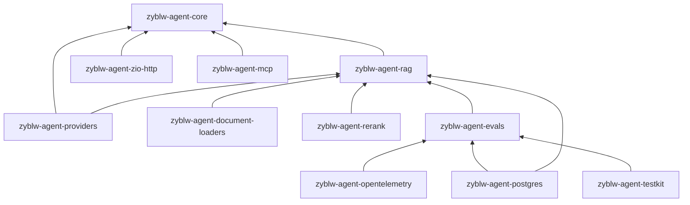

# zyblw-agent

`zyblw-agent` 是一个从零构建的 Scala 3 / ZIO 2 智能体应用框架。它不依赖 LLM4S、LangChain 或 LangGraph 运行时，而是借鉴这些框架的能力边界，让 ZIO 的 Fiber、Scope、ZStream 背压、ZLayer、类型化错误和确定性测试成为运行语义。

当前版本是可编译、可测试的基础设施版本，不宣称所有外围模块已经达到生产成熟度。

第一次阅读请从 [文档地图](docs/README.md) 与 [深入学习指南](docs/learning-guide.md) 开始；准备逐文件阅读时使用
[源码阅读路线](docs/source-tour.md)。

## 开源发布状态

- Maven 坐标：`io.github.zyblw`
- 源码仓库：`https://github.com/zyblw/zyblw-agent`
- 当前版本：[`0.2.0`](https://github.com/zyblw/zyblw-agent/releases/tag/v0.2.0)，已发布到 Maven Central。
- 当前发布线：`0.x`，遵循 Early SemVer；公开 API 在形成真实使用证据前仍允许有计划地调整。
- 许可证：Apache License 2.0。
- Git tag：`vX.Y.Z` 触发框架发布。
- CI 会执行统一格式门禁、全量测试、PostgreSQL Testcontainers、本地 Maven 发布，并让独立 consumer 只通过生成的
  二进制包编译，防止源码工程关系掩盖发布缺陷。

Central namespace、短期发布 token、GPG 签名密钥和 GitHub release environment 已完成配置。后续版本仍须按
[发布与回滚](docs/releasing.md) 的不可变 tag、签名、consumer 和回滚门禁执行。

## 业务项目如何引入

普通业务从稳定内核和 Provider 协议开始：

```scala
libraryDependencies ++= Seq(
  "io.github.zyblw" %% "zyblw-agent-core"      % "0.2.0",
  "io.github.zyblw" %% "zyblw-agent-providers" % "0.2.0"
)
```

需要数据库、HTTP、RAG 或 OTLP 时再引入对应扩展。公共发布面已从三十多个薄 artifact 收敛为 11 个；Scala package
仍然保持 model、tools、memory、context、runtime、app 等职责边界。选择规则见
[模块与发布坐标](docs/modules.md)，决策理由见
[ADR-0014](docs/architecture/0014-consolidate-public-modules.md)。

业务仓库应固定 Maven Central 上的精确版本。框架维护者需要跨仓联调时，可以先发布到本机 Maven 仓库，或在明确的本地
开发开关下使用 sibling checkout；生产构建不得依赖本地源码路径。开发、升级和回滚流程见
[server 消费指南](docs/consuming-from-server.md)。

## 核心闭环

```text
用户输入 → 创建/恢复 Run → 构建上下文 → 能力校验 → 模型流
→ 工具提议 → 参数校验 → 权限/Guardrail/审批 → 受控执行
→ 原子状态/事件/用量 → 下一轮 → 完成/暂停/失败/取消
```

## 已实现

- Scala 3 opaque ID、不可变消息、版本化 `AgentState`、步骤和分层事件。
- OpenAI-compatible Provider，支持 DeepSeek、GLM 与其他兼容 `/chat/completions` 服务。
- OpenAI Responses 原生 Provider：完整响应、typed SSE、工具调用、reasoning item 回放、usage、429/5xx、断流与取消传播。
- Anthropic Messages 原生 Provider：content blocks、tool_use/tool_result、thinking/signature 回放、typed SSE 与故障契约。
- Gemini Interactions 原生 Provider：2026 steps schema、function_call/function_result、signature 回放、typed SSE、usage、断流与取消契约。
- 模型能力描述、跨协议路由、调用前能力校验、ProviderContract 2.0 与 Redacted cassette。
- 真正的 SSE 流解析：任意网络分块、UTF-8 跨 chunk、并行工具参数增量、最终 usage、错误和空流。
- 类型化工具、受控异构注册、默认拒绝、scope、风险、审批、超时、并发和结果大小限制。
- 工具注册名称在启动阶段强制唯一，拒绝由装配顺序决定的静默覆盖。
- `InstructionSet` 把稳定 System/Developer 指令按 id/version 冻结并生成安全 fingerprint；旧 `withInstructions` 仍兼容。
- Provider-neutral usage 区分输入/输出总量、缓存输入和推理输出子集，并贯穿状态、Trace 与 Metrics。
- 无 API Key/数据库的 `AgentQuickstart` 仍走完整 submit/claim/Runtime/inspect 主链，提供真实的五分钟学习入口。
- 低敏 `RunInspection` 与 HTTP Timeline：分页、稳定阶段/结果、instruction fingerprint、usage 和一致性诊断；不暴露
  Prompt、消息历史、工具参数/结果或隐藏推理。
- 唯一 `AgentRuntime` 直接操作 `AgentState/RunStore`，统一上下文、Guardrail、类型化工具、执行账本、审批和恢复。
- 同一 Runtime 提供 `AgentEvent` SSE、256 容量背压队列、Scope/Fiber 生命周期和显式取消传播，不维护第二套状态投影。
- 跨节点耐久 SSE：数据库侧有界事件分页、sequence 连续性校验、`Last-Event-ID`、heartbeat 与 tenant/user 读取授权。
- `InMemoryRunStore` 的乐观锁、幂等事件、取消标记和工具执行账本。
- PostgreSQL `RunStore` Adapter、状态/事件原子事务、SQLSTATE 分类、Flyway migration 与真实 Testcontainers 契约测试。
- PostgreSQL 跨 worker 租约队列：`SKIP LOCKED` claim、heartbeat、过期重领、token/generation fencing、DeadLetter 与 ZIO Fiber 抢占。
- 耐久 command queue：审批、取消、恢复和显式重试都有独立 commandId、业务幂等键、状态与人工重试历史。
- 完全异步 StartRun：HTTP 以全局客户端幂等键原子提交 Created 状态、RunCreated、Start 命令和 dispatcher，WorkerHost
  在 lease/generation fencing 下启动模型循环；请求连接不再拥有 Run 生命周期。
- 正式 `WorkerHost`：把 command claim、heartbeat、`executeLeased`、AgentState 提交级 fencing、complete/abandon/dead-letter 组成单一部署路径。
- 工具冲突感知耐久批次：安全串行默认、批量 Prepared、受控并行、确定性结果提交与部分成功崩溃恢复。
- 真实写工具可靠性：业务 mutation、业务幂等结果、outbox 和补偿计划由同一 PostgreSQL transaction 原子提交。
- at-least-once 发布与消费：outbox 使用稳定 messageId、`SKIP LOCKED`、heartbeat、generation fencing 和死信；inbox 将稳定 messageId 去重与消费者业务写同事务提交。
- 显式 Saga 补偿：补偿计划随原操作注册，只有业务策略主动激活后才由受控 handler 执行。
- `agent-evals` 硬门禁：工具选择、引用/恢复正确性、延迟、token、成本；RAG Recall/Precision/MRR/NDCG、引用证据和授权完整性；
  Context 压缩的证据/引用保留、禁止内容、重复稳定性、调用次数和带版本价格预算。
- 评测趋势与发布制度：Agent/RAG/Context Compression 统一低敏快照、完整 kind/suite/dataset/version 身份、最近成功
  基线比较、显式首次 bootstrap、用例/维度删除检测；同时提供带 checksum/FileLock/fsync/崩溃尾恢复的文件 Store，
  以及经过 PostgreSQL 16 Testcontainers 验证的多节点不可变 `PostgresEvalTrendStore`。
- 独立 `agent-eval-cli`：严格读取低敏快照 artifact，使用 ZIO Config/`Config.Secret` 选择文件或 PostgreSQL Store，
  稳定区分通过、质量回归、配置错误和基础设施错误；未授权的首次通过候选不会被隐式写成下一次基线。
- Provider HTTP/SSE 故障契约：断流、慢流、负 usage、429/5xx 与取消传播。
- 真实 Provider 小流量门禁：统一低敏 `LiveProviderSmokeRunner`、五类 Provider CLI 和 LLM MemoryExtractor 工具调用
  smoke；Context 压缩另有固定约束/引用/注入数据、重复稳定性、主动超时和可选价格预算的真实 Provider smoke；
  默认 `testFull` 不访问公网或消耗真实额度。
- 真实 OpenAI-compatible Embedding Adapter：确定性分批、有界并发、index 重排、固定维度、usage、超时、429/5xx 与取消契约。
- Embedding 治理门面：可信 tenant/purpose/requestId、请求内去重、租户隔离缓存、原子窗口配额和幂等预留。
- PostgreSQL FTS + pgvector hybrid/RRF，多租户 tenant/permission 在候选排名前过滤，并暴露可解释排名信号。
- Cohere v2 原生 Reranker Adapter：HTTPS/Bearer、请求/响应硬上限、index 映射、search units、429/5xx 有界重试、总超时、取消传播和真实 ZIO HTTP stub 契约。
- 知识索引版本生命周期：ingestion 幂等、Building 暂存、短事务原子发布、失败恢复与 active 版本乐观条件。
- `RagApplication` 统一业务摄取/查询入口；内存与 PostgreSQL 都提供 `KnowledgeIndexStore & VectorStore` 同源
  ZLayer，避免业务手工复制向量或让示例绕过 active 发布协议。
- 独立文档加载流水线：有界 `ZStream[Byte]`、MIME 唯一注册、身份/元数据复核、单文件/并发摄取和取消传播；可选
  Tika 3.3.1 提供轻量 text/Markdown/HTML/PDF/EPUB 解析，Docling Serve v1 Adapter 提供受限 PDF→结构化 Markdown；
  `MarkdownStructureChunker` 保留标题、表格、代码块、Unicode 边界与稳定内容寻址 ID。
- Context 分区硬预算、完整消息 token 计数、工具结果压缩、原子 tool-call 回合裁剪、重复来源去重、低敏 Debug View 与 Context Rot 信号；`ContextSourceResolver` 已把长期 Memory 与带引用 RAG 按可信 tenant/user/scopes 接入主 Runtime。
- `zyblw-agent-core` 内可选的 `context.llm` 组件：统一 ChatModel + 唯一 strict tool 的逐字证据压缩、有限 repair、确定性降级、辅助模型预算/usage，
  `coveredMessages/sourceDigest` 耐久摘要 checkpoint、ZIO Config 加载器和
  `AgentApplication.*WithContextCompressor` 正式装配入口；Worker 恢复不会重复压缩相同历史前缀，
  `Deterministic` 策略也不会因为 LLM Layer 存在而产生隐形费用。
- PostgreSQL 长期 Memory：类型/证据/置信度/敏感等级、CAS 合并、tombstone 删除；用户查看/纠正/删除经过领域授权与
  同事务低敏审计，`MemoryHttpApi` 提供只从可信身份推导 scope 的业务路由；有界 Retention Worker 使用 Schedule、
  Scope 和 `SKIP LOCKED` 支持多 worker 安全清理。
- MemoryLifecycle：确定性策略拒绝、证据优先合并；可选 LLM Extractor 通过单一 strict tool、逐字 quote 和真实消息角色派生证据，默认禁止敏感记忆且没有删除协议。
- Input/Output/Tool/Run Guardrail、脱敏、持续时间 Trace、低基数 Metrics、OpenTelemetry OTLP、Langfuse Trace 与幂等 Scores、Prometheus/Grafana 基线。
- 声明式 Workflow Graph：节点与控制边分离，启动前检查缺失/不可达节点、未声明目标和无界循环；完整 checkpoint
  绑定 workflow/version/session 并保存游标、状态、step 与访问预算。
- V008 `PostgresWorkflowCheckpointStore`：完整快照容量/checksum/JSONB 校验、同 identity 单调 step、跨 Store
  暂停恢复；当前明确不冒充节点 execution lease。
- 有界 fan-out 与显式 `AllSucceeded` fan-in；分支失败会按 ZIO 结构化并发中断兄弟 Fiber，并隔离未完成的 join checkpoint。
- HTTP、示例、测试与 PostgreSQL 全部使用同一个 `AgentState/RunStore` 生产路径。
- 受深度、上下文与工具策略限制的 Handoff；不把它宣传为已成熟的多 Agent 调度平台。
- MCP 2025-11-25 客户端（stdio、Streamable HTTP、SSE/session 恢复、Tools/Resources/Prompts、受治理 sampling/elicitation、实验 Tasks）。
- 防路径/symlink 逃逸、原子写入和容量配额的 Workspace；默认断网、只读根文件系统、非 root、不可变镜像、CPU/内存/PID/时间/输出限额与 Fiber 取消传播的 OCI Sandbox。
- 多模态和 Knowledge Graph 的独立 SPI 模块。
- ZIO HTTP SSE Adapter、三个 CLI 示例、本地 benchmark smoke runner。
- `zyblw-agent-core` 的 `app` 业务易用层：不可变 `AgentDefinitionBuilder`、生产 `durable`/测试 `inMemory` ZLayer、统一
  `AgentApplication + AgentRuntime + AgentCommandService + WorkerHost`、Scope 管理的后台 Worker Fiber，以及带启动期约束的
  ZIO Config 工具/审批/重试/lease 配置加载。
- shell-safe ZIO Config 路径：统一点分 prefix 与 `snake_case` 叶子键，真实映射 Docker/Kubernetes 常用的
  `ZYBLW_AGENT_*` 环境变量；不再假设 ZIO 会自动把 segment 内的连字符改成下划线。
- `zyblw-agent-zio-http` 的独立部署宿主：异步 Agent routes、command worker、readiness/liveness 与 ZIO HTTP Server 共享内部
  子 Scope；Server 和关键 Worker 双向故障传播，支持 JDBC 探测硬超时、附加业务 routes 与关键后台进程。
- `zyblw-agent-zio-http` 内部独立的 `http.contract` package：`/api/v1` DTO、ZIO Schema、声明式 Endpoint 与机械 OpenAPI；Run/Event/Command 使用显式
  低敏公共投影，内部 `AgentState/PersistedAgentEvent` 不再成为客户端协议。

## 稳定性分层

| 层级              | 公共 artifact                                                                                                                                                                               |
| ----------------- | ------------------------------------------------------------------------------------------------------------------------------------------------------------------------------------------- |
| Stable foundation | `zyblw-agent-core`                                                                                                                                                                        |
| Beta adapter      | `zyblw-agent-providers`、`zyblw-agent-rag`、`zyblw-agent-postgres`、`zyblw-agent-zio-http`、`zyblw-agent-document-loaders`、`zyblw-agent-rerank`、`zyblw-agent-opentelemetry` |
| Beta              | `zyblw-agent-mcp`、`zyblw-agent-testkit`                                                                                                                                                |
| Experimental      | `zyblw-agent-evals`；仓库内 `agent-eval-cli` 不发布                                                                                                                                     |

Experimental 表示 API 和数据模式可能调整，不表示代码不可编译。

## 技术基线

- JDK 21
- Scala 3.8.4
- sbt 2.0.1
- ZIO 2.1.26
- zio-json 0.9.2
- zio-schema 1.8.5
- ZIO HTTP 3.11.3
- PostgreSQL JDBC 42.7.13
- OpenTelemetry API/SDK/OTLP exporter 1.63.0

## 构建与测试

```bash
sbt "scalafmtCheckAll; scalafmtSbtCheck"
sbt compile
sbt testFull
RUN_POSTGRES_INTEGRATION=1 sbt "postgres / Test / testFull"
sbt "examples/runMain com.zyblw.agent.examples.QuickstartAgentExample"
sbt "examples/runMain com.zyblw.agent.examples.GraphWorkflowExample"
sbt "examples/runMain com.zyblw.agent.examples.BasicAgentExample"
sbt "examples/runMain com.zyblw.agent.examples.ApprovalAgentExample"
sbt "examples/runMain com.zyblw.agent.examples.RagAgentExample"
sbt "examples/runMain com.zyblw.agent.examples.ContextCompressionEvalExample"
sbt "examples/runMain com.zyblw.agent.examples.ContextCompressionLiveSmokeExample"
sbt "examples/runMain com.zyblw.agent.examples.EvalTrendGateExample"
sbt "evalCli/runMain com.zyblw.agent.evals.cli.EvalReleaseGateCli"
sbt "examples/runMain com.zyblw.agent.examples.StandaloneHttpAgentExample"
sbt "benchmarks/runMain com.zyblw.agent.benchmarks.LocalBenchmarks"
```

sbt 2 的 `test` 是增量测试；发布和 CI 应使用 `testFull`。环境变量会改变 Testcontainers 用例是否执行，但不会自动改变
sbt 的增量指纹，因此 PostgreSQL 全量契约也必须显式使用 `postgres / Test / testFull`，不能用普通 `test`
判断数据库门禁已经运行。

Embedding 生产调用通过 `GovernedEmbeddingService` 强制携带 tenant/purpose/requestId；多 Worker 使用
`PostgresAgentPersistence.embeddingGovernance` 获得精确缓存与事务化租户配额。设计、表结构、ZLayer 装配和清理方式见
[Embedding 治理指南](docs/embedding-governance.md)。

## 发布依赖



## 文档

- [模块选择与公开边界](docs/modules.md)
- [发布与回滚](docs/releasing.md)
- [业务仓库消费与跨仓联调](docs/consuming-from-server.md)
- [宿主数据库迁移边界](docs/database-migrations.md)
- [快速开始](docs/getting-started.md)
- [能力审计、主流框架对照与演进判断](docs/framework-assessment.md)
- [指令、Context 与成本工程](docs/instruction-context-cost.md)
- [AgentApplication、Builder 与业务接入](docs/application-builder.md)
- [ZIO HTTP 生产宿主、健康检查与生命周期](docs/http-host.md)
- [HTTP API、OpenAPI 与 Schema 演进](docs/http-api-versioning.md)
- [Run Inspector、Timeline 与安全调试](docs/run-inspection.md)
- [核心概念](docs/core-concepts.md)
- [架构和 ADR](docs/architecture.md)
- [Provider](docs/providers.md)
- [工具](docs/tools.md)
- [可靠写工具、Outbox/Inbox 与补偿](docs/side-effects.md)
- [运行时](docs/runtime.md)
- [跨节点耐久事件流与 SSE](docs/durable-streaming.md)
- [Context、Memory 与 RAG](docs/context-memory-rag.md)
- [模型辅助 Context 压缩与耐久摘要](docs/context-compression.md)
- [Context 压缩质量评测与发布门禁](docs/context-compression-evaluation.md)
- [长期记忆用户治理、事务审计与 Retention Worker](docs/memory-governance.md)
- [Embedding 缓存、租户配额与生产调用边界](docs/embedding-governance.md)
- [Reranker 契约、治理与 Retriever 安全边界](docs/reranker.md)
- [文档 Loader、Tika 与批量知识摄取](docs/document-loaders.md)
- [RAG Recall/MRR/NDCG、引用与授权评测门禁](docs/rag-evaluation.md)
- [评测趋势仓库、基线比较与 CI 发布门禁](docs/eval-trend-and-release-gate.md)
- [持久化](docs/persistence.md)
- [PostgreSQL 表设计与 SQL](docs/database-schema.md)
- [安全](docs/security.md)
- [可观测性](docs/observability.md)
- [MCP 2025-11-25 集成](docs/mcp.md)
- [Workspace 与 OCI Sandbox](docs/sandbox.md)
- [ProviderContract 2.0](docs/provider-contract-2.md)
- [真实 Provider 小流量 Smoke 与 MemoryExtractor Eval](docs/provider-live-smoke.md)
- [测试](docs/testing.md)
- [深入学习指南](docs/learning-guide.md)
- [源码阅读路线：文件、方法、测试与掌握标准](docs/source-tour.md)
- [成熟框架参考与演进 ADR](docs/architecture/0008-framework-evolution.md)
- [成熟度、取舍与路线](docs/maturity-and-roadmap.md)

ZIO 相关语义以 [ZIO 官方文档](https://zio.dev/llms.txt) 为准；HTTP/流式接口以 [ZIO HTTP 官方文档](https://ziohttp.com/llms.txt) 为准。
