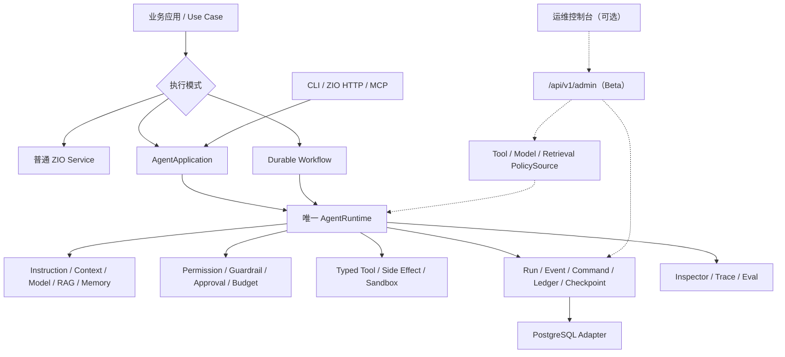

# zyblw-agent

`zyblw-agent` 是面向 Scala 3 / ZIO 2 的 Agent Application Runtime。它不把智能体简化为一次 LLM 调用，也不要求业务把
所有逻辑都改写成图；它提供一条 Provider-neutral、可恢复、可授权、可评测的执行主线，让业务按问题复杂度选择普通 ZIO
Service、Agent、Harness 或 Durable Workflow。

```text
可信请求 → 耐久 Run/Command → Worker lease/fencing → AgentRuntime
        → Context/Model → Tool policy/approval → 状态、事件与用量原子提交
        → 暂停/恢复/取消 → 低敏 Inspector、Trace 与 Eval
```

当前唯一版本线是 `0.9.0`，只支持全新数据库与重新摄入知识文档。完整操作见
[0.9.0 全新安装](docs/fresh-install-0.9.0.md)。

## 什么时候使用哪一层

| 业务问题 | 推荐入口 | 原因 |
|---|---|---|
| 确定性查询、计算、规则 | 普通 ZIO Service | 最低成本、最容易测试 |
| 开放式分析、动态工具选择 | `AgentApplication` | 模型负责不可预编程的判断，Runtime 负责执行控制 |
| 多小时任务、计划与工作区 | Agent + Harness（演进中） | Goal/Plan/Todo/Artifact 是耐久状态，不只是一段 Prompt |
| 审批、分支、并行汇合、崩溃恢复 | `WorkflowEngine`（Experimental） | 步骤与恢复边界显式、可检查 |

Harness 不是第二套模型循环；Workflow 也不替代普通函数。多 Agent 只有在固定 Eval 证明优于单 Agent 时才值得增加。

## 生产参考入口

开发与运行基线：

- JDK 21
- Scala 3.8.4
- sbt 2.0.1
- ZIO 2.1.26
- PostgreSQL 16+
- 可配置的 OpenAI-compatible Provider

`0.9.0` 的书籍问答入口是 `KnowledgeQaHost`；客户支持与审批写工具仍走 `ProductionSupportHost`。二者都需要 PostgreSQL、可信身份头和 ZIO HTTP。`AgentQuickstart` 已删除。

```bash
export ZYBLW_AGENT_JDBC_URL=jdbc:postgresql://127.0.0.1:5432/zyblw_agent
export ZYBLW_AGENT_DB_USER=zyblw_migrate
export ZYBLW_AGENT_DB_PASSWORD=...
export OPENAI_BASE_URL=https://api.openai.com/v1
export OPENAI_API_KEY=...
export OPENAI_MODEL=gpt-4.1-mini

sbt "examples/runMain com.zyblw.agent.examples.knowledge.KnowledgeQaHost migrate"
sbt "examples/runMain com.zyblw.agent.examples.knowledge.KnowledgeQaHost ingest data/books"
export ZYBLW_AGENT_DB_USER=zyblw_runtime
sbt "examples/runMain com.zyblw.agent.examples.knowledge.KnowledgeQaHost serve"
```

创建 Run 返回 `202`：HTTP 只提交耐久命令，Worker 随后推进。调用方用 `Idempotency-Key`、`X-Tenant-Id`、`X-User-Id` 和 runId 查询 `/api/v1/runs/{runId}`。退款工具会停在 `WaitingForApproval`，必须由可信身份调用审批接口。

业务项目引入：

```scala
libraryDependencies ++= Seq(
  "io.github.zyblw" %% "zyblw-agent-core"      % "0.9.0",
  "io.github.zyblw" %% "zyblw-agent-providers" % "0.9.0",
  "io.github.zyblw" %% "zyblw-agent-postgres"  % "0.9.0",
  "io.github.zyblw" %% "zyblw-agent-zio-http"  % "0.9.0"
)
```

第一支持面是 Docker 直连自管 PostgreSQL，见 [Docker 接入手册](docs/operations-docker-vm.md)。长时 soak、主备、PgBouncer 和滚动发布等宿主证据已延期，不阻止当前业务接入。CI 可用 `ZYBLW_AGENT_RUNTIME_MODE=contract` 跑脚本化模型，那不是生产配置。完整接入见 [总体使用手册](docs/usage-guide.md) 和 [快速开始](docs/getting-started.md)。

## 最小业务代码

Agent 定义与运行装配分开：定义描述业务意图和可见能力，应用层负责 Runtime、命令 worker 与资源生命周期。

```scala
val definition =
  AgentDefinitionBuilder(AgentId("knowledge-assistant"), "知识助手")
    .withInstructions("只依据已授权资料回答；资料不足时明确说明。")
    .allowTool(ToolName("search_knowledge"))
    .buildFor(toolPolicy)

val program =
  for
    agent   <- definition
    app     <- ZIO.service[AgentApplication]
    command <- app.submit(
      agent,
      RunRequest(
        ThreadId("thread-1"),
        AgentMessage.user("请总结这份资料"),
        RunContext(Some("user-1"), Some("tenant-1"), Set("knowledge:read"))
      ),
      idempotencyKey = "client-generated-uuid"
    )
  yield command
```

测试使用 `AgentApplication.inMemory`；生产使用 `AgentApplication.durable` 并显式提供 PostgreSQL、Provider、
`ContextSourceResolver`、`GuardrailEngine` 和 `RunObserver`。生产入口不会在数据库故障时静默回退到内存。完整 ZLayer
装配见 [AgentApplication 与 Builder](docs/application-builder.md)。

## 架构地图



必须保持的边界：

1. 模型只提出文本、结构化结果或工具调用；Runtime 校验、授权、执行和终止。
2. Provider-neutral ADT、Runtime、工具、权限、Context 和 Memory 留在 `agent-core`。
3. JDBC、HTTP、文档解析、MCP、Provider、Reranker 和 Telemetry 都是可选 Adapter。
4. Fiber/Scope 管取消、并发和资源；ZLayer 显式描述依赖，不在 Builder 中藏全局单例。
5. Snapshot 用于快速恢复，Event/Ledger 用于审计与诊断；外部副作用仍需业务幂等键或 outbox/inbox。
6. Inspector、Trace 和 Eval 只读低敏投影，不成为第二个状态事实源。
7. 管理面是可选子表面：每项能力由宿主显式提供，未提供就不挂载路由；它改变部署工作点，不改变 Agent 的行为契约。

架构理由、完整时序和 ADR 见 [架构总览](docs/architecture.md)。

## 能力地图

| 领域 | 当前可用能力 | 成熟度与主要缺口 |
|---|---|---|
| Agent Runtime | typed error、预算、审批、恢复、取消、流式事件 | Foundation；仍需长运行故障与负载证据 |
| Tool / Side Effect | typed schema、scope、风险、冲突、幂等、outbox/inbox、补偿 | Foundation/Experimental；需要更多真实写业务 |
| Durable Control | command queue、有界 Run 并发、lease、heartbeat、generation fencing、低敏 queue snapshot | Foundation；短时三实例 drain、中断重领、独立 JVM `SIGKILL`/数据库 restart，以及正式 Runtime 的 3 Worker/6 lane 有界 soak 回归阈值已验证；仍需业务长时 soak、节点/主备故障与生产 SLO |
| Workflow | 静态图校验、循环预算、fan-out、checkpoint、execution ledger、低敏 timeline/wake queue、durable wait/signal、受监督 wake worker | Experimental；独立 JVM `SIGKILL` + PostgreSQL restart 后双 generation 接管及 3 Worker/126 Run 有界 wake soak 已验证；仍需数据库 failover、节点丢失、长时 soak、人工任务与子图 |
| Context / Memory | 分区预算、压缩、可信来源、长期记忆治理 | Beta；需要真实长会话质量趋势 |
| RAG | 目录/PDF 摄取、Markdown+JSON、page/bbox lineage、结构切分、hybrid、rerank、相邻/同父级扩展、citation、eval | Beta；真实 OCR/恶意 PDF/大规模容量待验收 |
| Provider | OpenAI-compatible、Responses、Anthropic、Gemini 与 capability contract | Beta；需要持续真实流量证据 |
| 管理面 / 运维控制台 | scope fail-closed、能力探测、keyset 目录、CAS 配置覆盖与审计、Run SSE 调试器、七个面板 | Beta；跨 Run 成本聚合与嵌入式部署待完成 |
| 模型治理 | 目录 fail-closed 校验、运行时 Provider/模型切换、探活、脱敏 HTTP 失败分类、价目表成本估算 | Beta；按 Agent 粒度覆盖与自动降级链待完成 |
| HTTP / Ops | 异步 v1 API、耐久 SSE、OpenAPI、健康检查、Inspector、OTLP/Langfuse | Foundation/Beta；CLI、告警与事故演练待完成 |
| MCP / Sandbox / Eval | MCP client、Workspace/OCI 边界、趋势门禁 | Beta/Experimental；OAuth、真实隔离和人工校准待完成 |

逐项证据和下一验收条件以 [成熟度与路线](docs/maturity-and-roadmap.md) 为准，不以 README 的宣传文字为准。

## 仓库结构

```text
modules/agent-core              领域 ADT、Runtime、工具、权限、Context/Memory、调度、应用 Builder、观测 SPI
modules/agent-rag               知识索引、Embedding 治理、混合检索
modules/agent-document-loaders  Tika / Docling 文档加载与结构切分（重依赖隔离）
modules/agent-rerank            外部 Rerank HTTP 协议
modules/agent-evals             固定数据集评测、趋势与发布门禁
modules/agent-providers         OpenAI-compatible / Responses / Anthropic / Gemini 适配与模型目录
modules/agent-postgres          Flyway migration、耐久控制面、pgvector 知识索引、管理面 Store
modules/agent-zio-http          HTTP v1 契约、Routes、OpenAPI、Host、管理面 API
modules/agent-mcp               MCP client 与受控 Workspace
modules/agent-opentelemetry     OTLP/Langfuse SDK 与 Exporter
modules/agent-testkit           确定性 Fake/Stub
modules/agent-dashboard         Next.js 运维控制台（不发布 Maven 制品）
modules/agent-eval-cli          仓库内评测 CLI（不发布）
modules/agent-benchmarks        基准（不发布）
modules/agent-examples          可运行示例（不发布）
integration-tests/maven-consumer  只依赖已发布制品的独立消费者
```

## 依赖怎么选

不要一次引入全部模块。每个公开 artifact 都对应依赖、生命周期、协议或安全边界：

| 需要的能力 | 引入 artifact | 说明 |
|---|---|---|
| Agent Runtime、Tool、Context、Memory、Workflow SPI | `zyblw-agent-core` | 所有业务的最小起点 |
| OpenAI-compatible、Responses、Anthropic、Gemini | `zyblw-agent-providers` | 只在接真实模型时加入 |
| Knowledge Index、Embedding、Retrieval | `zyblw-agent-rag` | 不包含 PDF 解析器 |
| Tika、Docling、PDF/Markdown Loader | `zyblw-agent-document-loaders` | 重型解析依赖保持可选 |
| 外部模型 Rerank | `zyblw-agent-rerank` | 与基础检索分离 |
| PostgreSQL、Flyway、pgvector | `zyblw-agent-postgres` | 生产耐久控制面与知识索引 |
| HTTP v1、OpenAPI、Routes、Host、管理面 | `zyblw-agent-zio-http` | 可嵌入既有 ZIO HTTP Server |
| MCP client 与 Workspace 边界 | `zyblw-agent-mcp` | 外部内容始终按不可信输入处理 |
| OTLP、Langfuse | `zyblw-agent-opentelemetry` | SDK、Exporter 和后台资源不进入 core |
| Eval 与 release gate | `zyblw-agent-evals` | 固定数据集和趋势质量门禁 |
| 确定性 Fake/Stub | `zyblw-agent-testkit` | 业务测试依赖 |

所有模块统一版本，完整依赖图和 Maven 坐标见 [公开 artifact 与依赖](docs/modules.md)。

## RAG 业务接入

框架负责可复用的摄取与检索机制，业务负责语料选择、权限映射、领域 metadata、拒答规则和质量标准。业务 Controller、Job
或 Tool 优先依赖 `RagApplication`：

```text
PDF/Markdown
→ LocalDirectory/ObjectStorage DocumentInput
→ DocumentLoader（Tika 或受限 Docling Markdown+JSON）
→ DocumentStructureChunker（block/page/bbox/parent/neighbor）
→ Embedding 治理
→ KnowledgeIndex Building/Activate
→ ACL 前置的 Hybrid Retrieval
→ Rerank / 有界谱系扩展 / Citation / Context Budget
```

本地可用 `InMemoryKnowledgeIndexStore.knowledge`；新建生产知识库在 0.6.0 Published 后替换为
`PostgresAgentPersistence.migratedKnowledge1024()`（应用启动时自动迁移），或由部署任务先调用
`AgentPostgresMigrations.migrateKnowledge1024` 后使用 `PostgresAgentPersistence.knowledge(1024)`。知识对象与 Flyway history
位于 `zyblw_agent_knowledge` 专属 schema。详细代码见
[文档摄取](docs/document-loaders.md)、[PDF RAG 生产流水线](docs/pdf-rag-pipeline.md)、[Context/Memory/RAG](docs/context-memory-rag.md) 与
[RAG 评测](docs/rag-evaluation.md)。

## 运维控制台（可选）

管理面把“现在有哪些 Run 在跑”“队列积压在哪”“工具白名单和审批策略是什么”“跑的是哪个模型”“检索工作点合不合适”
放在一个界面上，并让其中的部署工作点可以在不重启的情况下修改：

```bash
cd modules/agent-dashboard
npm ci
npm run dev          # 打开 http://localhost:3000，在右上角填写后端地址与 token
```

三条必须理解的边界：

1. **默认不存在。** 每项管理能力都是宿主提供的 `Option`；未提供就不挂载路由，`GET /api/v1/admin/capabilities`
   如实报告不可用，控制台隐藏对应页签而不是渲染一个只会 404 的面板。
2. **授权与业务侧不同。** 管理面看到的是跨租户聚合，因此要求显式 scope：`agent:admin:read` 读聚合，
   `agent:admin:write` 改部署行为（蕴含 read），`agent:admin:debug` 覆盖会产生真实 Provider 费用的检索沙盒、
   文档摄入与模型探活（**不**被 write 蕴含）。
3. **不接触业务正文与凭据。** Run 列表只有元数据，Prompt、模型输出和工具参数属于业务数据；API Key 既不被接受也不被
   返回或存储，只以 `env:DEEPSEEK_API_KEY` 这样的引用与“是否存在”呈现。

管理面是显式标记的 Beta 表面，不进入 `AgentHttpContract` 的稳定 OpenAPI 承诺。装配方式、端点清单与设计取舍见
[管理 API 与运维控制台](docs/admin-console.md)，前端约定见 [控制台 README](modules/agent-dashboard/README.md)。

## 生产接入顺序

准备把框架用于真实业务时，先按[生产接入基线与发布候选判定](docs/production-readiness.md)区分框架门禁、业务验收和
分阶段扩流；不要把 `testFull` 绿色直接解释为某个业务已经生产就绪。

1. 按生产参考宿主接入 PostgreSQL、真实 Provider、可信身份和 ZIO HTTP，先跑通 `migrate` 再 `serve`。
2. 用 `ScriptedChatModel` 与 `AgentApplication.inMemory` 写确定性业务测试；不要把内存装配当成部署入口。
3. 写工具保持固定 SQL、稳定业务幂等键、审批和 outbox；模型参数不能变成语句。
4. 运行账号只有 DML。Flyway 与结构探针属于部署任务。
5. 需要运维界面时再装配管理面，并单独确定入口、身份来源与限流。
6. 当前单库 Docker 路径通过业务接入门禁即可引进；7 项宿主证据保持 `deferred`，在约定窗口的生产流量上测量后再补，不宣称通用 production-supported。

ZIO HTTP Adapter 使用 `Routes` 组合业务路由，并用声明式 `Endpoint`/ZIO Schema 维护 `/api/v1` 与 OpenAPI；Server 和
关键 worker 由同一 Scope 管生命周期。它不会创建 DataSource、匿名认证或 Provider Secret。详见
[ZIO HTTP 宿主](docs/http-host.md) 和 [HTTP 兼容](docs/http-api-versioning.md)。

## 上生产前必须回答的问题

框架提供机制，业务仍拥有最终策略和运行责任：

1. **身份与权限**：`RunContext` 的 user/tenant/scope 是否来自已经验签的可信身份，而不是请求正文或模型输出？
2. **预算与过载**：步骤、模型、工具、token、费用、wall-clock、队列和 Worker 并发是否都有上限？达到上限时如何降级？
3. **外部副作用**：写工具是否有稳定业务幂等键、审批、outbox/inbox、补偿和审计？
4. **数据与隐私**：Prompt、工具结果、RAG 文档、Memory、Trace 和 Eval 的保留、删除、脱敏策略是什么？
5. **恢复**：数据库重启、worker 被杀、Provider 断流、lease 过期和重复命令是否经过演练？
6. **可观测性**：能否从低敏 Timeline、typed error、指标和 trace 判断排队、运行、工具、恢复和投影阶段？
7. **质量**：是否有固定业务数据集分别评估 outcome、trajectory、safety、latency、token 和 cost？
8. **管理面**：谁可以持有 `agent:admin:*`？运行时覆盖的审计历史由谁复核？调试端点的费用上限是什么？
9. **升级**：是否验证 Scala API、HTTP Schema、State JSON、Flyway migration 和活跃 Workflow Run？

只通过单元测试而没有容量、故障、升级和真实业务质量证据时，应标记为可运行或 Experimental，不能宣称生产就绪。

## 安装契约与故障定位

`0.9.0` 空库只执行 core V001 与独立 1024 knowledge V001。应用不提供旧 schema、旧向量维度或旧状态的升级入口；
探测到非当前基线时直接拒绝启动。完整边界见[兼容性契约](docs/compatibility.md)与
[0.9.0 全新安装](docs/fresh-install-0.9.0.md)。

常见问题先按边界定位：

| 现象 | 首先检查 | 不应采用的“修复” |
|---|---|---|
| Run 一直排队 | command worker、lease、数据库健康、队列指标 | 在生产入口静默改用内存 Store |
| 工具被拒绝 | allowlist、scope、risk、approval 和 schema error | 让模型自行声明权限 |
| 同一动作重复 | idempotency key、execution ledger、outbox/inbox | 无限增加 retry |
| SSE 中断 | `Last-Event-ID`、耐久 Event、认证与反向代理超时 | 把内存 Hub 当历史事实源 |
| RAG 无结果 | active index、tenant ACL、embedding identity、候选过滤 | 绕过 ACL 直接向量检索 |
| Workflow 无法恢复 | definition/version/session、checkpoint/outcome checksum、wait 状态与 execution fence | 忽略 identity 或并行绕过 Store |
| 控制台页签缺失 | `GET /api/v1/admin/capabilities`、宿主是否装配该能力、scope | 在前端硬编码显示所有页签 |
| 模型切换保存成功却没生效 | 该配置项声明的生效边界、`ModelPolicySource` 是否接入、副本刷新周期 | 直接改数据库覆盖表 |
| 测试耗尽 native thread | 是否并行启动多个 sbt、Netty stub 生命周期 | 删除并发/流式契约测试 |
| Provider 行为差异 | capability、wire contract、原始 HTTP 状态的低敏诊断 | 假设所有 Provider 字段等价 |

系统化排查路径见 [测试](docs/testing.md)、[Run Inspector](docs/run-inspection.md)、
[可观测性](docs/observability.md) 与 [安全](docs/security.md)。

## 学习与源码阅读路线

推荐按“能运行 → 会接入 → 懂内核 → 能扩展 → 会运营”学习：

1. **能运行**：[文档地图](docs/README.md)、[总体使用手册](docs/usage-guide.md)、[快速开始](docs/getting-started.md)
2. **会接入**：[核心概念](docs/core-concepts.md)、[AgentApplication 与 Builder](docs/application-builder.md)、[Provider 与能力协商](docs/providers.md)
3. **懂内核**：[架构总览](docs/architecture.md)、[运行时](docs/runtime.md)、[工具](docs/tools.md)、[持久化](docs/persistence.md)、[Workflow](docs/workflow.md)
4. **能扩展**：[Context/Memory/RAG](docs/context-memory-rag.md)、[源码阅读路线](docs/source-tour.md)、[代码注释与阅读约定](docs/code-commenting-guide.md)、[学习指南](docs/learning-guide.md)
5. **会运营**：[生产接入基线](docs/production-readiness.md)、[管理 API 与控制台](docs/admin-console.md)、[可观测性](docs/observability.md)、[测试](docs/testing.md)、[成熟度与路线](docs/maturity-and-roadmap.md)

参与开发前请读 [AGENTS.md](AGENTS.md)（人和编码代理共用的工作约定）与[贡献指南](CONTRIBUTING.md)。

## 构建、测试与发布

```bash
sbt -batch 'scalafmtCheckAll; scalafmtSbtCheck; testFull'
RUN_POSTGRES_INTEGRATION=1 sbt -batch postgres/testFull
./integration-tests/command-worker-kill-recovery.sh --restart-postgres
./integration-tests/workflow-wake-worker-kill-recovery.sh --restart-postgres
./integration-tests/durable-worker-soak.sh
./integration-tests/workflow-wake-worker-soak.sh
sbt -batch 'set ThisBuild / version := "0.9.0-local"; publishM2'
cd integration-tests/maven-consumer && ZYBLW_AGENT_VERSION=0.9.0-local sbt -batch compile
```

控制台单独验证：

```bash
cd modules/agent-dashboard
npm run typecheck && npm run lint && npm run build
npm run test:e2e:install && npm run test:e2e
```

sbt 2 的普通 `test` 是增量测试；CI、发布和 PostgreSQL 契约必须使用 `testFull`。真实 Provider 测试默认关闭，避免普通
PR 访问公网或消耗额度。连续在同一个常驻 sbt server 上跑多轮 `testFull` 可能耗尽 class space，出现
`OutOfMemoryError: Compressed class space` 时重启 sbt server 即可。

- Maven group：`io.github.zyblw`
- 开源仓库：<https://github.com/zyblw/zyblw-agent>
- License：Apache-2.0
- 发布规则：[发布与回滚](docs/releasing.md)
- 模块选择：[公开 artifact 与依赖](docs/modules.md)
- 变更记录：[CHANGELOG](CHANGELOG.md)

ZIO 并发、Scope、ZLayer 与测试语义以 [ZIO 官方文档](https://zio.dev/llms.txt) 为准；HTTP 路由、Endpoint、SSE 和 Server
生命周期以 [ZIO HTTP 官方文档](https://ziohttp.com/llms.txt) 为准。
