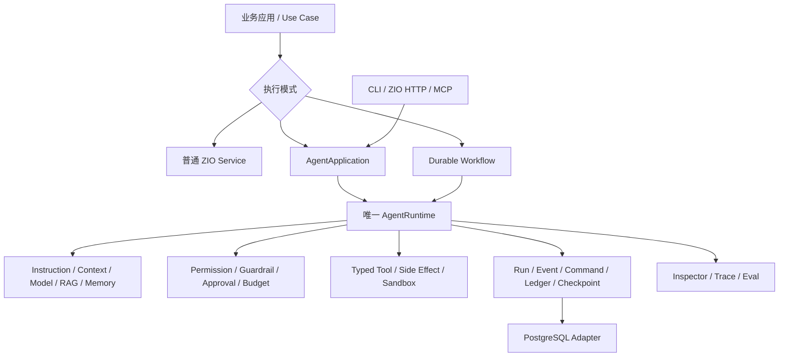

# zyblw-agent

`zyblw-agent` 是面向 Scala 3 / ZIO 2 的 Agent Application Runtime。它不把智能体简化为一次 LLM 调用，也不要求业务把
所有逻辑都改写成图；它提供一条 Provider-neutral、可恢复、可授权、可评测的执行主线，让业务按问题复杂度选择普通 ZIO
Service、Agent、Harness 或 Durable Workflow。

```text
可信请求 → 耐久 Run/Command → Worker lease/fencing → AgentRuntime
        → Context/Model → Tool policy/approval → 状态、事件与用量原子提交
        → 暂停/恢复/取消 → 低敏 Inspector、Trace 与 Eval
```

当前最新发布版是 [`0.2.1`](https://github.com/zyblw/zyblw-agent/releases/tag/v0.2.1)，已发布到
[Maven Central](https://central.sonatype.com/artifact/io.github.zyblw/zyblw-agent-core_3/0.2.1)。项目仍处于
`0.x` 演进期：核心单 Agent 控制面已经形成闭环，外围 Adapter 和 Durable Workflow 等能力按证据标记为 Beta 或
Experimental；“有实现”不等于已经经过大规模生产验证。

## 什么时候使用哪一层

| 业务问题 | 推荐入口 | 原因 |
|---|---|---|
| 确定性查询、计算、规则 | 普通 ZIO Service | 最低成本、最容易测试 |
| 开放式分析、动态工具选择 | `AgentApplication` | 模型负责不可预编程的判断，Runtime 负责执行控制 |
| 多小时任务、计划与工作区 | Agent + Harness（演进中） | Goal/Plan/Todo/Artifact 是耐久状态，不只是一段 Prompt |
| 审批、分支、并行汇合、崩溃恢复 | `WorkflowEngine`（Experimental） | 步骤与恢复边界显式、可检查 |

Harness 不是第二套模型循环；Workflow 也不替代普通函数。多 Agent 只有在固定 Eval 证明优于单 Agent时才值得增加。

## 五分钟运行

开发基线：

- JDK 21
- Scala 3.8.4
- sbt 2.0.1
- ZIO 2.1.26

业务项目从最小依赖开始：

```scala
libraryDependencies ++= Seq(
  "io.github.zyblw" %% "zyblw-agent-core"      % "0.2.1",
  "io.github.zyblw" %% "zyblw-agent-providers" % "0.2.1"
)
```

在源码仓库中，无需 API Key 和数据库即可验证完整的
`submit → command claim → AgentRuntime → inspect` 主路径：

```bash
sbt "examples/runMain com.zyblw.agent.examples.QuickstartAgentExample"
```

预期结果：

```text
status=Completed, answer=你好，zyblw-agent 的最小运行链路已经完成。
```

这个示例使用确定性模型和内存控制面，适合学习接线与测试；进程退出后数据会丢失，不能作为生产持久化方案。接下来按
[快速开始](docs/getting-started.md) 完成工具、真实 Provider、PostgreSQL、HTTP 和 RAG 接入。

## 最小业务代码

Agent 定义与运行装配分开：定义描述业务意图和可见能力，应用层负责 Runtime、命令 worker 与资源生命周期。

```scala
val definition =
  AgentDefinitionBuilder(AgentId("knowledge-assistant"), "知识助手")
    .withInstructions("只依据已授权资料回答；资料不足时明确说明。")
    .allowTool(ToolName("search_knowledge"))
    .buildFor(toolPolicy)

val program =
  for
    agent   <- definition
    app     <- ZIO.service[AgentApplication]
    command <- app.submit(
      agent,
      RunRequest(
        ThreadId("thread-1"),
        AgentMessage.user("请总结这份资料"),
        RunContext(Some("user-1"), Some("tenant-1"), Set("knowledge:read"))
      ),
      idempotencyKey = "client-generated-uuid"
    )
  yield command
```

测试使用 `AgentApplication.inMemory`；生产使用 `AgentApplication.durable` 并显式提供 PostgreSQL、Provider、
`ContextSourceResolver`、`GuardrailEngine` 和 `RunObserver`。生产入口不会在数据库故障时静默回退到内存。完整 ZLayer
装配见 [AgentApplication 与 Builder](docs/application-builder.md)。

## 架构地图



必须保持的边界：

1. 模型只提出文本、结构化结果或工具调用；Runtime 校验、授权、执行和终止。
2. Provider-neutral ADT、Runtime、工具、权限、Context 和 Memory 留在 `agent-core`。
3. JDBC、HTTP、文档解析、MCP、Provider、Reranker 和 Telemetry 都是可选 Adapter。
4. Fiber/Scope 管取消、并发和资源；ZLayer 显式描述依赖，不在 Builder 中藏全局单例。
5. Snapshot 用于快速恢复，Event/Ledger 用于审计与诊断；外部副作用仍需业务幂等键或 outbox/inbox。
6. Inspector、Trace 和 Eval 只读低敏投影，不成为第二个状态事实源。

架构理由、完整时序和 ADR 见 [架构总览](docs/architecture.md)。

## 能力地图

| 领域 | 当前可用能力 | 成熟度与主要缺口 |
|---|---|---|
| Agent Runtime | typed error、预算、审批、恢复、取消、流式事件 | Foundation；仍需长运行故障与负载证据 |
| Tool / Side Effect | typed schema、scope、风险、冲突、幂等、outbox/inbox、补偿 | Foundation/Experimental；需要更多真实写业务 |
| Durable Control | command queue、lease、heartbeat、generation fencing | Foundation；需要多节点 soak、SLO、备份恢复 |
| Workflow | 静态图校验、循环预算、fan-out、checkpoint、execution ledger、低敏 timeline、durable wait/signal、受监督 wake worker | Experimental；kill/restart/multi-worker soak、人工任务、子图待完成 |
| Context / Memory | 分区预算、压缩、可信来源、长期记忆治理 | Beta；需要真实长会话质量趋势 |
| RAG | PDF/Markdown 摄取、结构切分、embedding 治理、hybrid、rerank、citation、eval | Beta；block/page lineage、parent-child、恶意 PDF/OCR 待完成 |
| Provider | OpenAI-compatible、Responses、Anthropic、Gemini 与 capability contract | Beta；需要持续真实流量证据 |
| HTTP / Ops | 异步 v1 API、耐久 SSE、OpenAPI、健康检查、Inspector、OTLP/Langfuse | Foundation/Beta；CLI/UI、告警与事故演练待完成 |
| MCP / Sandbox / Eval | MCP client、Workspace/OCI 边界、趋势门禁 | Beta/Experimental；OAuth、真实隔离和人工校准待完成 |

逐项证据和下一验收条件以 [成熟度与路线](docs/maturity-and-roadmap.md) 为准，不以 README 的宣传文字为准。

## 依赖怎么选

不要一次引入全部模块。每个公开 artifact 都对应依赖、生命周期、协议或安全边界：

| 需要的能力 | 引入 artifact | 说明 |
|---|---|---|
| Agent Runtime、Tool、Context、Memory、Workflow SPI | `zyblw-agent-core` | 所有业务的最小起点 |
| OpenAI-compatible、Responses、Anthropic、Gemini | `zyblw-agent-providers` | 只在接真实模型时加入 |
| Knowledge Index、Embedding、Retrieval | `zyblw-agent-rag` | 不包含 PDF 解析器 |
| Tika、Docling、PDF/Markdown Loader | `zyblw-agent-document-loaders` | 重型解析依赖保持可选 |
| 外部模型 Rerank | `zyblw-agent-rerank` | 与基础检索分离 |
| PostgreSQL、Flyway、pgvector | `zyblw-agent-postgres` | 生产耐久控制面与知识索引 |
| HTTP v1、OpenAPI、Routes、Host | `zyblw-agent-zio-http` | 可嵌入既有 ZIO HTTP Server |
| MCP client 与 Workspace 边界 | `zyblw-agent-mcp` | 外部内容始终按不可信输入处理 |
| OTLP、Langfuse | `zyblw-agent-opentelemetry` | SDK、Exporter 和后台资源不进入 core |
| Eval 与 release gate | `zyblw-agent-evals` | 固定数据集和趋势质量门禁 |
| 确定性 Fake/Stub | `zyblw-agent-testkit` | 业务测试依赖 |

所有模块统一版本，完整依赖图和 Maven 坐标见 [公开 artifact 与依赖](docs/modules.md)。

## RAG 业务接入

框架负责可复用的摄取与检索机制，业务负责语料选择、权限映射、领域 metadata、拒答规则和质量标准。业务 Controller、Job
或 Tool 优先依赖 `RagApplication`：

```text
PDF/Markdown
→ DocumentLoader（Tika 或受限 Docling）
→ MarkdownStructureChunker
→ Embedding 治理
→ KnowledgeIndex Building/Activate
→ ACL 前置的 Hybrid Retrieval
→ Rerank / Citation / Context Budget
```

本地可用 `InMemoryKnowledgeIndexStore.knowledge`；生产替换为
`PostgresAgentPersistence.knowledge(dimension = 1536)` 并显式执行对应 pgvector migration。详细代码见
[文档摄取](docs/document-loaders.md)、[Context/Memory/RAG](docs/context-memory-rag.md) 与
[RAG 评测](docs/rag-evaluation.md)。

## 生产接入顺序

1. 先跑无密钥 Quickstart，确认 JDK、sbt 和主链路。
2. 用 `ScriptedChatModel`、内存 Store 和 Fake Tool 写确定性业务测试。
3. 接入真实 Provider，但保持工具只读、额度小、live smoke 显式启用。
4. 引入 PostgreSQL，共享宿主 `DataSource`，显式执行框架 Flyway migration。
5. 将身份从已验签 claim/session 映射为 `RunContext`，再暴露 ZIO HTTP routes。
6. 接入受控写工具、业务幂等键、outbox/inbox 和审批。
7. 建固定 Eval、SLO、告警、备份恢复和 kill/recover 演练后再扩大流量。

ZIO HTTP Adapter 使用 `Routes` 组合业务路由，并用声明式 `Endpoint`/ZIO Schema 维护 `/api/v1` 与 OpenAPI；Server 和
关键 worker 由同一 Scope 管生命周期。它不会创建 DataSource、匿名认证或 Provider Secret。详见
[ZIO HTTP 宿主](docs/http-host.md) 和 [HTTP 兼容](docs/http-api-versioning.md)。

## 上生产前必须回答的问题

框架提供机制，业务仍拥有最终策略和运行责任：

1. **身份与权限**：`RunContext` 的 user/tenant/scope 是否来自已经验签的可信身份，而不是请求正文或模型输出？
2. **预算与过载**：步骤、模型、工具、token、费用、wall-clock、队列和并发是否都有上限？达到上限时如何降级？
3. **外部副作用**：写工具是否有稳定业务幂等键、审批、outbox/inbox、补偿和审计？
4. **数据与隐私**：Prompt、工具结果、RAG 文档、Memory、Trace 和 Eval 的保留、删除、脱敏策略是什么？
5. **恢复**：数据库重启、worker 被杀、Provider 断流、lease 过期和重复命令是否经过演练？
6. **可观测性**：能否从低敏 Timeline、typed error、指标和 trace 判断排队、运行、工具、恢复和投影阶段？
7. **质量**：是否有固定业务数据集分别评估 outcome、trajectory、safety、latency、token 和 cost？
8. **升级**：是否验证 Scala API、HTTP Schema、State JSON、Flyway migration 和活跃 Workflow Run？

只通过单元测试而没有容量、故障、升级和真实业务质量证据时，应标记为可运行或 Experimental，不能宣称生产就绪。

## 兼容、升级与故障定位

当前 `main` 是允许破坏性重构的 `0.3.0` 开发线，不承诺从 `0.2.x` 原地升级。公开的 `0.2.1` artifact/tag 保持不可变；
试用当前源码必须使用空 schema/新数据库执行单一 0.3 baseline，并重新构建派生 RAG 索引。进入 `0.3.0` 正式发布后，
后续 `0.3.x` patch 才恢复 minor 内兼容承诺。完整边界见 [兼容性契约](docs/compatibility.md)。

常见问题先按边界定位：

| 现象 | 首先检查 | 不应采用的“修复” |
|---|---|---|
| Run 一直排队 | command worker、lease、数据库健康、队列指标 | 在生产入口静默改用内存 Store |
| 工具被拒绝 | allowlist、scope、risk、approval 和 schema error | 让模型自行声明权限 |
| 同一动作重复 | idempotency key、execution ledger、outbox/inbox | 无限增加 retry |
| SSE 中断 | `Last-Event-ID`、耐久 Event、认证与反向代理超时 | 把内存 Hub 当历史事实源 |
| RAG 无结果 | active index、tenant ACL、embedding identity、候选过滤 | 绕过 ACL 直接向量检索 |
| Workflow 无法恢复 | definition/version/session、checkpoint/outcome checksum、wait 状态与 execution fence | 忽略 identity 或并行绕过 Store |
| 测试耗尽 native thread | 是否并行启动多个 sbt、Netty stub 生命周期 | 删除并发/流式契约测试 |
| Provider 行为差异 | capability、wire contract、原始 HTTP 状态的低敏诊断 | 假设所有 Provider 字段等价 |

系统化排查路径见 [测试](docs/testing.md)、[Run Inspector](docs/run-inspection.md)、
[可观测性](docs/observability.md) 与 [安全](docs/security.md)。

## 学习与源码阅读路线

推荐按“能运行 → 会接入 → 懂内核 → 能扩展 → 会运营”学习：

1. [文档地图](docs/README.md) 与 [快速开始](docs/getting-started.md)
2. [核心概念](docs/core-concepts.md) 与 [AgentApplication](docs/application-builder.md)
3. [运行时](docs/runtime.md)、[工具](docs/tools.md)、[持久化](docs/persistence.md)
4. [Workflow](docs/workflow.md) 与 [Context/Memory/RAG](docs/context-memory-rag.md)
5. [源码阅读路线](docs/source-tour.md) 与 [代码注释和阅读约定](docs/code-commenting-guide.md)
6. [测试](docs/testing.md)、[可观测性](docs/observability.md)、[成熟度路线](docs/maturity-and-roadmap.md)

## 构建、测试与发布

```bash
sbt -batch 'scalafmtCheckAll; scalafmtSbtCheck; testFull'
RUN_POSTGRES_INTEGRATION=1 sbt -batch postgres/testFull
sbt -batch 'set ThisBuild / version := "0.3.0-local"; publishM2'
```

sbt 2 的普通 `test` 是增量测试；CI、发布和 PostgreSQL 契约必须使用 `testFull`。真实 Provider 测试默认关闭，避免普通
PR 访问公网或消耗额度。

- Maven group：`io.github.zyblw`
- 开源仓库：<https://github.com/zyblw/zyblw-agent>
- License：Apache-2.0
- 发布规则：[发布与回滚](docs/releasing.md)
- 模块选择：[公开 artifact 与依赖](docs/modules.md)
- 变更记录：[CHANGELOG](CHANGELOG.md)

ZIO 并发、Scope、ZLayer 与测试语义以 [ZIO 官方文档](https://zio.dev/llms.txt) 为准；HTTP 路由、Endpoint、SSE 和 Server
生命周期以 [ZIO HTTP 官方文档](https://ziohttp.com/llms.txt) 为准。
