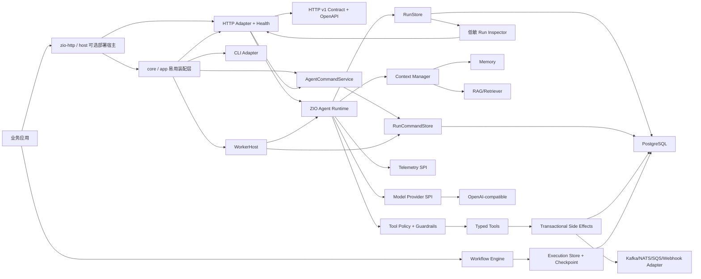
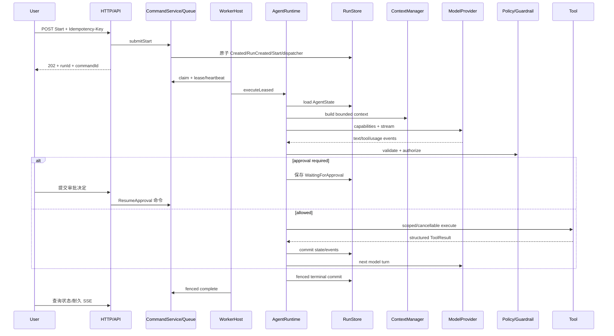

# 架构总览

> 状态：当前说明（模块稳定度见 [成熟度与路线](maturity-and-roadmap.md)）
>
> 最后核验：2026-07-30
>
> 事实来源：对应模块源码、测试与构建定义

## 设计边界

模型只提出文本、结构化结果或工具调用。Runtime 负责能力校验、授权、执行、持久化、预算、终止和观测。Provider、数据库、HTTP、OpenTelemetry、MCP 与业务服务不能反向污染 `agent-core`。

框架的应用语义分为 Agent、Harness 与 Workflow：Agent 负责开放式模型循环；Harness 负责 Goal/Plan/Todo、Workspace、
Artifact、Skill、Context 和 Sandbox 等长任务支架；Workflow 负责显式步骤、路由和恢复边界。它们按需组合，不是三个
强制部署服务，也不自动对应三个 Maven artifact。完整决策见
[ADR 0016](architecture/0016-agent-application-runtime.md)。

`zyblw-agent-core` 中的 `app` package 位于业务宿主与运行控制层之间，只组合
`AgentRuntime/AgentCommandService/WorkerHost` 及其稳定 SPI。它不会定义
第二套状态、隐藏数据库 fallback 或把 Provider 类型引入 core；生产 `durable` 入口要求业务显式提供持久化、Context、
Guardrail 和 Observer。

`zyblw-agent-zio-http` artifact 位于最外层传输边界；其中 `http.host` package 只把 `AgentHttpApi` routes、command
worker、健康探针与 ZIO HTTP Server 放入同一个子 Scope。它不反向进入 Runtime，也不创建 DataSource、认证或 Provider
Secret；嵌入已有业务服务器时只组装 routes，不启动独立 Host。

同一 artifact 中的 `http.contract` package 位于客户端与 HTTP Adapter 之间，只承载 `/api/v1` DTO、ZIO Schema、
Endpoint 与 OpenAPI；`http` package 通过显式公共投影把授权后的 `AgentState/AgentEvent` 转成低敏协议对象，内部恢复
Schema 不再等于外部 wire Schema。首次公开版本不再为这个很小的 package 单发 artifact；如果出现两个以上只消费协议
而不运行 JVM Runtime 的真实客户端，再以 ADR 评估拆分。

下图是当前已经落地的主路径。HTTP、CLI 与恢复 worker 都调用同一个 `AgentRuntime`；`ContextManager`、
`GuardrailEngine`、`RegisteredToolRegistry`、`ToolExecutor` 和 `RunStore` 已进入同一状态机。

Inspector 从授权后的权威 State 与耐久 Event 生成只读 Timeline 和一致性诊断。它不承担恢复和重放，因此不会成为与
Runtime 竞争的第二套状态；它也不复制 Prompt、消息、工具参数/结果或隐藏推理。边界见
[Run Inspector、Timeline 与安全调试](run-inspection.md)。

## Agent Run 时序

## ADR

- [0001 核心运行时](architecture/0001-core-runtime.md)
- [0002 状态和事件](architecture/0002-agent-state-and-events.md)
- [0003 工具安全](architecture/0003-tool-security-model.md)
- [0004 Provider](architecture/0004-provider-abstraction.md)
- [0005 持久化恢复](architecture/0005-persistence-and-recovery.md)
- [0006 Workflow 边界](architecture/0006-workflow-boundary.md)
- [0007 可观测性](architecture/0007-observability.md)
- [0008 成熟框架参考与 ZIO 原生演进](architecture/0008-framework-evolution.md)
- [0009 跨 worker 调度、工具冲突计划与业务评测](architecture/0009-distributed-scheduling-and-evals.md)
- [0010 耐久控制命令队列](architecture/0010-durable-command-queue.md)
- [0011 事务写工具、Outbox/Inbox 与显式补偿](architecture/0011-transactional-side-effects.md)
- [0012 独立、版本化的 HTTP 公共契约](architecture/0012-versioned-http-contract.md)
- [0013 开源发布边界](architecture/0013-open-source-release-boundary.md)
- [0014 收敛公共模块](architecture/0014-consolidate-public-modules.md)
- [0015 独立公共仓库](architecture/0015-independent-public-repository.md)
- [0016 Agent Application Runtime 与三层边界](architecture/0016-agent-application-runtime.md)
