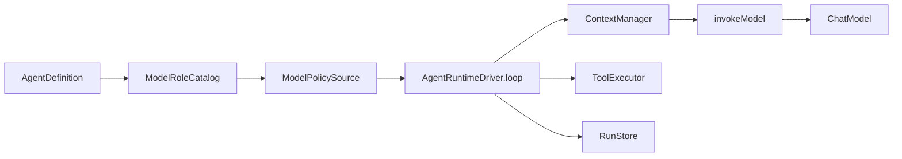

# Model Runtime 现状审计

> 状态：Phase 0 审计（不是现行实现合同）
>
> 最后核验：2026-09-17
>
> 事实来源：`agent-core` / `agent-providers` / `agent-testkit` / `agent-postgres` / `agent-evals` / `agent-opentelemetry` 源码与测试；平台宿主 `zyblw-platform/zyblw-server` 装配；[成熟度与路线](../maturity-and-roadmap.md)、[ADR-0004](0004-provider-abstraction.md)、[ADR-0018](0018-next-generation-runtime-kernel.md)
>
> 配套： [目标架构](model-runtime-target.md) · [路由](model-routing.md) · [Provider 契约](model-provider-contract.md) · [预算与成本](model-budget-and-cost.md) · [多模型执行](multi-model-execution.md)

本文以下审计表保留 **Phase 0 编码前快照**，其中“缺失/尚未接线”是该快照的结论。
Phase 1 已新增的主调用路由、最小账本、准入检查，以及 Qwen/Kimi 一级兼容档案、配置驱动多端点/中转站和 smoke 入口，以 [目标架构的当前落地边界](model-runtime-target.md) 和
[预算状态表](model-budget-and-cost.md) 为准；不能把历史缺口表当成当前实现清单。

本文件回答：现有 zyblw-agent **已经是什么**，以及提示词中的 Model Runtime / Routing Plane **缺在哪里**。它不授权重写 Runtime，也不把示例接口名当成必须落地的类型。

四条已成立、后续必须守住的边界：

1. **Agent ≠ Model**。没有 `QwenAgent` / `DeepSeekAgent`。
2. **ToolCall = Proposal**。模型只提出调用；Runtime 校验、授权、记账、执行。
3. **Router ≠ LLM**。当前主路径已有 `ModelRouterGateway` 的 Experimental 档位路由和 `RoutedChatModel` 的按 Provider 点名转发；路由仍是可验证策略，不由另一个 LLM 自由决定。
4. **Multi-model ≠ Multi-agent**。多模型应发生在步骤级，而不是再造一套 Agent 社会。

---

## 1. 当前相关模块

| Artifact | 与模型相关的职责 | 成熟度（路线图口径） |
|---|---|---|
| `agent-core` / `model` | `ChatModel` SPI、`ModelCapabilities`、`RoutedChatModel`、`FallbackChatModel`、`ModelRole` | Foundation |
| `agent-core` / `core` | `ChatRequest` / `ChatResponse`、`ModelSettings`、`ModelCall` 账本、`ModelPolicy`、`ModelPriceBook`、`RunLimits` | Foundation / Beta |
| `agent-core` / `runtime` | `AgentRuntimeDriver.persistAndInvokeModel` / `invokeModel`；纯预算/结算在 `AgentKernel` | Foundation |
| `agent-core` / `context`、`memory.llm` | `ContextManager`、`LlmContextCompressor`、`LlmMemoryExtractor`（旁路 `ChatModel` 调用） | Beta |
| `agent-core` / `admin` | `ModelCatalog` 视图、运行时稀疏覆盖、探活入口 | Beta |
| `agent-core` / `workflow`、`harness` | 显式图与 Goal 预算；**没有** `ModelProfile` 节点 | Experimental |
| `agent-providers` | OpenAI-compatible、Responses、Anthropic、Gemini；`ProviderEndpoints`、`ProviderRegistry`、`ModelCatalogLive` | Beta |
| `agent-testkit` | `ProviderContract` 2.0、`ScriptedChatModel` | Foundation |
| `agent-rag` | 独立 `EmbeddingModel`，不走 Chat SPI | Beta |
| `agent-document-loaders` | `VisionPageDocumentLoader` 再走一遍 `ChatModel` | Beta |
| `agent-postgres` | `model_call_executions` 与 Run / Event / Tool 同事务 | Beta |
| `agent-opentelemetry` | GenAI semconv、禁 Prompt；无 `model.route` span | Beta |
| `agent-evals` | 轨迹回放、资源预算；无 RouterEval | Experimental |
| `zyblw-platform` | `QaProviderConfigLoader` + `tcm-learning-assistant`；命名档案或 `ProviderEndpoints` 多端点装配，不接 `FallbackChatModel` | 业务宿主 |

依赖方向未变：providers / postgres / http / otel → core。Model Runtime 必须落在这条边上，不能平行长出第二套执行内核。

---

## 2. 当前调用链

生产主路径（同步 `run` 与 durable `executeLeased` 共用同一 loop）：

```text
Host assembly
  ProviderRouter / ProviderEndpoints / QaProviderConfigLoader
    → ZLayer[ChatModel]

AgentApplication / AgentCommandService.submitStart
  → ModelRoleCatalog.applyTo（Run 创建时冻结 provider/model）
  → AgentState Created + RunCreated + Start command

WorkerHost / CommandWorker.claim
  → AgentRuntimeDriver.executeLeased
  → loop:
       ensureBudget
       guardrails
       ContextManager.build → ChatRequest(messages, tools, settings)
       model.capabilities + CapabilityValidator.validate
       persistAndInvokeModel
         → ModelCallWrite.Insert (optional)
         → model.stream(request)
         → fold ModelStreamEvent → AgentEvent
       若 assistant 含 ToolCall:
         createDurableToolPlan → 权限 / 风险 / 审批 / 幂等
         ToolExecutor → AgentMessage.tool → 下一轮
```



旁路调用（不经主 loop 账本，除非各自另记）：

- `LlmContextCompressor`
- `LlmMemoryExtractor`
- `VisionPageDocumentLoader`
- `ModelAdminLive.probe`

这些旁路是后续接入 Model Runtime 的第二批，不是第一刀。

---

## 3. 当前 Provider abstraction

运行时 SPI 是 `ChatModel`，不是提示词里的新 `ModelProvider` 草图。

| 类型 | 位置 | 职责 |
|---|---|---|
| `ChatModel` | `agent-core/.../model/ChatModel.scala` | `complete` / `stream` / `capabilities` |
| `ModelProvider` | 同上，extends `ChatModel` | 仅 Responses / Anthropic / Gemini 使用；OpenAI-compatible 直接实现 `ChatModel` |
| `ChatRequest` / `ChatResponse` | `core/Model.scala` | 厂商无关请求响应；账本用 `CanonicalModelRequest` |
| `ModelSettings` | 同上 | `provider`、`model`、可选 `ModelRole`、`providerOptions`、`metadata` |
| `ProviderDescriptor` + `ModelCapabilities` | `ChatModel.scala` | 静态 / 每模型能力；运行前 `CapabilityValidator` |
| `RoutedChatModel` | `ChatModel.scala` | 按 `ModelSettings.provider` **点名**转发 |
| `FallbackChatModel` | `model/FallbackChatModel.scala` | 装配期冻结的 retryable 降级链 |
| `ModelRole` / `ModelRoleCatalog` | `model/ModelRole.scala` | 任务角色 → 1:1 `provider/model`；创建时冻结 |
| `ModelPolicy` / `ModelPolicySource` | `core/ModelPolicy.scala` | 运行时稀疏覆盖已注册组合；不热增 Provider、不改 toolChoice |
| `ProviderContract` | `agent-testkit` | **测试契约**，不是运行时 SPI |

已落地 Adapter：

| 协议 | 实现 | 备注 |
|---|---|---|
| OpenAI Chat-compatible | `OpenAICompatibleChatModel` | DeepSeek / GLM 走 `OpenAICompatibility` preset |
| OpenAI Responses | `OpenAIResponsesChatModel` | `ModelProvider` |
| Anthropic Messages | `AnthropicMessagesChatModel` | `ModelProvider` |
| Gemini Interactions | `GeminiInteractionsChatModel` | `ModelProvider` |
| Qwen / Kimi | 无单独类 Adapter | 复用 `OpenAICompatibleChatModel` 与 `OpenAICompatibility.qwen/kimi`；可通过命名环境档案或 endpoints JSON / relay 装配 |

core **不 import** 厂商 SDK。泄漏面是字符串 metadata（`reasoning_content`、`gemini.interactions.steps`、`anthropic.messages.content_blocks`）和 `providerOptions`。这些只允许作 Provider continuation 优化，不得成为跨 Provider 正确性依赖。

---

## 4. 当前 Tool Call 生命周期

```text
Provider 流事件
  ToolCallStarted / ToolCallDelta / ToolCallCompleted
    → 归一化为 core.ToolCall(id, name, arguments)
    → ChatResponse.message = assistantToolCalls
    → AgentRuntimeDriver.createDurableToolPlan
    → ToolCallRequested
    → whitelist / schema / risk / approval / budget / idempotency
    → ToolExecutor
    → tool_executions 账本
    → AgentMessage.tool
    → 下一轮模型
```

不变量（已有测试覆盖）：

- Provider 不得执行工具。
- 崩溃后按 `ToolExecutionRecord` 状态恢复，不因模型重试重复副作用。
- v5+ `DurableToolPlan` 冻结工具契约指纹；漂移 fail-closed。
- 审批绑定 `ApprovalSubject`，不是“批准这个工具名即可永远再用”。

Model Runtime 换 Qwen / DeepSeek / Gemini **不能**缩短这条链。

---

## 5. 当前 Runtime 生命周期

```text
Created → Running
       → WaitingForApproval | Suspended
       → Completed | Failed | Cancelled | TimedOut | BudgetExceeded
```

- 同步：`AgentRuntime.run` / `runEvents`，无 lease。
- 耐久：`submitStart` → command queue → lease / heartbeat / fencing → `executeLeased`。
- 恢复读 `AgentState` + tool ledger + model-call ledger；没有第二套 checkpoint 投影。
- 模型调用是 loop 内 Activity，**不是**独立 `RunCommandPayload`。现有命令只有 Start / Recover / ResumeApproval / Cancel / Retry（人工操作重试整个 Run）。

`invokeModel` 消费 `model.stream`，把 text / tool-call delta / usage 投影为 `AgentEvent`。`ReasoningDelta` **被丢弃**，不作为控制信号，也不进入默认持久化事件。

---

## 6. 当前持久化模型

权威在 PostgreSQL（或测试内存 Store），一次 fenced 事务可同时推进 State / Events / Tool / ModelCall。

| 表 / 记录 | 作用 | 与 Model Runtime 的关系 |
|---|---|---|
| `agent_runs` | `AgentState` JSON + version CAS | 含 `pendingModelCall`、usage、budget |
| `agent_events` | 精选耐久事件 | `ModelCallPrepared` / `Started` / `Completed` / `Unknown` |
| `model_call_executions` | Intent → Settlement / Unknown | 默认 MetadataOnly：指纹、provider、model、usage；Replayable 才存 canonical request |
| `tool_executions` | 副作用账本 | 与模型 retry 隔离 |
| `agent_run_commands` + dispatch | 控制面 | 不承载单次 model.call |
| Workflow / Harness 表 | 独立账本 | 今日不存 RouteDecision |

**不要**为静态 endpoint、logical alias、API Key 建 `model_catalog` 表。配置留在部署；动态运营数据（调用、费用、路由决策）才进库。

---

## 7. 当前可观测能力

- `TelemetryEvent` + `AgentTelemetry.span`；GenAI semconv v1.37.0。
- 允许：`gen_ai.provider.name`、`gen_ai.request.model`、token、duration、run id。
- 禁止：Prompt、消息正文、工具参数/结果、RAG 文档、API Key。
- `ModelPriceBook` 把 usage 折成 `estimatedCost`；框架不内置厂商价目表。
- **没有** `model.route` span，也没有 profile / decisionCodes / fallbackCount 的一等属性。
- `FallbackChatModel` 把 `fallback-chain` / `fallback-from` 写入 `ModelSettings.metadata`（低基数，不进 prompt）。

---

## 8. 当前 Eval 能力

`agent-evals` 已有：

- 四轴：Outcome / Trajectory / Safety / Resource
- `TrajectoryReplay`：Replayable 账本重建 `ChatRequest`
- tool-selection、citation、recovery、forbidden-tool、duplicate-side-effect、resource-budget
- `pass@k`、Wilson 区间、趋势快照、发布门禁

缺失：

- 按 task category 比较 Fast / Standard / Reasoning 的 **RouterEval**
- 内部质量分作为 Router soft score 的数据源
- Shadow / Canary
- 业务数据集里的 Amazon 分析、Vision、Coding 黄金集（平台 QA 另有业务评测，不替代框架 RouterEval）

---

## 9. 重复抽象

| 重复 | 说明 | 处理 |
|---|---|---|
| `RoutedChatModel` vs `ProviderRouter` vs `MultiProviderChatModel` | 三种装配“按名字选 Provider” | 收敛到 ModelRuntime 装配，不并排加第四个 |
| `ChatModel` vs `ModelProvider` | 命名层，行为几乎相同 | 保留两者；新 Adapter 优先 `ModelProvider` |
| 平台 additional/multi-endpoint 注册 vs `FallbackChatModel` | 意图重叠、语义不同 | 额外注册仅用于点名路由；故障切换必须显式接 Fallback/Router 并持久化决策 |
| 新 `ModelRequest`/`ModelResponse` vs 现有 Chat ADT | 提示词示例与现码冲突 | **不新建替换类型**；演进 `ChatRequest`/`ChatResponse` |
| Chat vs Embedding | 故意分离 | 保持独立；Router 不得假设同厂商绑定 |

---

## 10. 可以复用的代码

第一批直接复用，不要重写：

- `ChatModel` / `CapabilityValidator` / `ModelStreamEvent`
- `ChatRequest` / `ChatResponse` / `CanonicalModelRequest`
- `ModelCallExecutionRecord` + `CapturePolicy`
- `ModelRole`（任务角色，不是 Profile）
- `ModelPolicySource` + `ModelCatalog` 已注册组合校验
- `ModelPriceBook` + `TokenUsage`（cached / reasoning 不重复计费）
- `RunLimits` / `BudgetState` / `ContextBudget`
- `RetryPolicy` / `CircuitBreakerPolicy` / `RateLimitPolicy` / `ReliabilityPolicy` **类型**（尚未接线）
- `FallbackChatModel` 的 retryable / fail-closed 规则
- `ProviderContract.verifySuite`
- `ToolExecutionRecord` 幂等与 fencing
- `GenAiSemanticMap.ForbiddenAttributeKeys`
- `SanitizingTelemetry`

---

## 11. 应废弃的历史方向（不是删除现网代码）

- 按提示词再声明一套 `trait ModelProvider { complete(model, request) }` 并让业务改调用。
- 把 `ProviderContract` 提升为运行时 SPI。
- 为静态模型目录 / API Key 建表。
- 默认 LLM Router 或 Bandit。
- 把 hidden chain-of-thought 写入 Event / Inspector。
- 因“不喜欢答案”自动换三个模型（那是 Escalation，且必须显式策略）。
- 为目录漂亮拆 `agent-model-runtime` module。
- 复活已删除的 `com.zyblw.agent.multimodal` / `KnowledgeGraph`。
- 在 Workflow 里写 `DeepSeekStep`。
- 让 Planner 直接执行 SQL / shell / 任意 class。

---

## 12. Compatibility strategy

| 现有表面 | Phase 0–5 策略 |
|---|---|
| `ChatModel.complete` / `stream` | 保留；ModelRuntime 内部调用它 |
| `ModelSettings.provider` / `model` | 保留；显式指定时 Router 只做硬约束校验，记 `legacy-explicit-model` |
| `ModelRole` | 保留；配置映射到默认 `ModelProfile`，不删 planner/summarizer |
| `ModelPolicy` 稀疏覆盖 | 保留；覆盖的是已注册组合，不能突破 allowlist |
| `FallbackChatModel` | 保留到 Router 接线后，再标内部实现 |
| `RoutedChatModel` | 保留为装配适配；新代码不新增调用点 |
| `ProviderContract` | 只扩展用例，不改角色 |
| 已发布 Flyway | 只 append；RouteDecision 进现有账本或邻接列 |
| 平台 QA Agent | 零业务语义改动即可换 Standard primary |

旧调用经 adapter 进入同一编排。全部模块（含 compressor / extractor / vision loader）迁完之前，不删 deprecated API。

---

## 13. 能力对照总表

| 能力 | 状态 | 位置 |
|---|---|---|
| Provider-neutral Chat SPI | 已完成 | `ChatModel` |
| 归一化 ToolCall / Stream | 已完成 | `ModelStreamEvent`、`ToolCall` |
| Tool proposal → 执行控制面 | 已完成 | `AgentRuntimeDriver` + `AgentKernel` + tool ledger |
| ModelCall 耐久账本 | 部分完成 | 代码在；生产 soak / Replayable 证据不足 |
| 能力预检 | 已完成 | `CapabilityValidator` |
| 任务角色 1:1 绑定 | 已完成 | `ModelRoleCatalog` |
| 步骤级 ModelProfile | **缺失** | — |
| ModelRequirement | **缺失** | — |
| 确定性策略路由 + RouteDecision | **缺失** | 现有只是点名转发 |
| Hard vs Soft 分离 | **缺失** | — |
| DataSensitivity 路由 | **缺失** | 记忆/RAG 有租户隔离，Chat 路由没有 |
| 同模型 Retry | **缺失** | Runtime 不自动重试模型 |
| Fallback | 部分完成 | `FallbackChatModel` 未接平台 QA |
| Escalation / Cascade | **缺失** | — |
| ReliabilityPolicy 接线 | 部分完成 | 类型在 `Policy.scala`，Chat 路径未用 |
| Pricing version / 历史重算 | **缺失** | `ModelPriceBook` 无 version |
| Provider Health / 统一限流 | **缺失** | 仅 429 分类 |
| Qwen 单独类 Adapter | **不计划** | 已有 Qwen 一级兼容档案与命名环境装配，复用 OpenAI-compatible 传输 |
| DeepSeek / Gemini / GLM | 已完成 / 部分 | preset 或原生 Adapter |
| `model.route` / `model.call` 分层 span | **缺失** | 现有 generation span |
| RouterEval / Shadow / Canary | **缺失** | — |
| Planner / ModelStep | **缺失** | Harness Plan ≠ LLM TaskPlan |

---

## 14. 第一批将来要改的文件（本审计不改）

协议与编排：

- `modules/agent-core/src/main/scala/com/zyblw/agent/model/ChatModel.scala`
- `modules/agent-core/src/main/scala/com/zyblw/agent/core/Model.scala`
- `modules/agent-core/src/main/scala/com/zyblw/agent/model/ModelRole.scala`
- `modules/agent-core/src/main/scala/com/zyblw/agent/core/ModelCall.scala`
- `modules/agent-core/src/main/scala/com/zyblw/agent/core/Error.scala`
- `modules/agent-core/src/main/scala/com/zyblw/agent/core/Policy.scala`
- `modules/agent-core/src/main/scala/com/zyblw/agent/runtime/AgentRuntimeDriver.scala`
- `modules/agent-core/src/main/scala/com/zyblw/agent/runtime/AgentKernel.scala`
- `modules/agent-core/src/main/scala/com/zyblw/agent/model/FallbackChatModel.scala`
- `modules/agent-providers/src/main/scala/com/zyblw/agent/integrations/ProviderRouter.scala`

本 Phase 0 **只新增文档**。编码从 Phase 1 开始，且必须在本审计被审阅之后。
