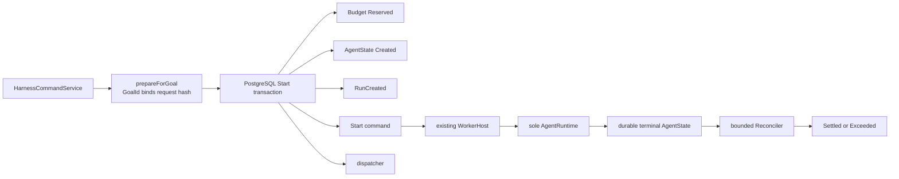

# 下一代 Runtime 开发手册

> 状态：**历史工作手册**（当前事实以 `0.9.0` 源码与正式运行手册为准）
> 最后核验：2026-09-23
> 决策来源：[ADR-0018](0018-next-generation-runtime-kernel.md)（Kernel 铁律）+ [ADR-0019](0019-typed-extensions-and-constrained-execution.md)（Typed Extensions / Precise Approvals / Constrained Execution 与 Wave 路线）
> 事实来源：`modules/agent-core` 现行代码与测试；外部框架仅作对照，不作为本仓库合同
>
> 迁移编号说明：本文保留的 V004–V010、AgentState v4–v6 是候选期实现谱系。相关表和约束已全部折叠进当前 0.9 fresh-install 的 State v1 与 SQL V001。`0.9` 不读取旧 Run、旧工具计划或缺字段 JSON。下文进度表里的旧编号只说明当时落地了什么，不能作为现行升级或安装步骤。

本文指导后续**逐步开发**。P0 Kernel、P1 Composition 与 P2 Harness（ADT/CAS、PostgreSQL Adapter、Steering/FollowUp、typed ArtifactReference、成对 Eval、跨 Run 任务预算）已落地。后续路线按 ADR-0019 的 **Wave 0–3** 推进（见 §5.5 与 §16）；P3–P4 仍为 Proposed。现行行为以 [architecture.md](../architecture.md)、[runtime.md](../runtime.md)、[persistence.md](../persistence.md) 与源码为准。

证据标签：

- **FACT**：可由当前源码、测试或已发布 migration 直接证明
- **INFERENCE**：由 FACT 推出的架构判断
- **UNKNOWN**：会影响设计、落地前必须用测试或调查关闭
- **Proposed**：本手册的目标，尚未实现

---

## 1. 怎么用这份文档

阅读顺序：

1. [ADR-0018](0018-next-generation-runtime-kernel.md) — 决定与否决
2. 本文 §3–§4 — 现行事实与必须保留的不变量
3. 当前要做的阶段章节（P0 从 §16–§17 开始）
4. 再改代码

每完成一个 vertical slice，更新本节「实施进度」，并按 §19 写阶段报告。不要并行做 P0–P4。

### 实施进度

| 阶段 | 状态 |
|---|---|
| ADR-0018 + 本手册 | 文档已写 |
| P0 第一刀：CanonicalModelRequest + ModelCall ledger + 重建 + crash | **已落地**（in-memory + 确定性测试；Postgres 集成测试需 `RUN_POSTGRES_INTEGRATION=1`） |
| P0 随后：Tool retry vs crash replay 语义拆分 | **已落地**（`ToolRetryPolicy` 在线；`ToolRecoveryPolicy` 崩溃重放；账本表未改） |
| P0 crash matrix：Disabled / settlement 失败 / Complete 窗口 / lease lost / 预算保留 | **已落地**（in-memory 确定性注入；Postgres stale fenced ModelCall 测试需 `RUN_POSTGRES_INTEGRATION=1`） |
| P0 Store 原子性：状态 + 事件 + ModelCall ledger | **已落地修复**（in-memory 单一 `Ref.Synchronized`；冲突后状态、事件与账本均不变化） |
| P0 持久化信封：关系列 + JSON typed payload | **已落地**（State/Event/Tool/ModelCall 读取交叉校验；PostgreSQL 18 篡改测试 fail-closed） |
| P1 Composition / DX 第一刀：Profile + fingerprint + drift + CapturePolicy 配置 | **已落地**（创建冻结；恢复 Incompatible/RequiresRevalidation fail-closed；工具计划冻结 Schema/安全契约与单调审批要求。候选期曾按版本兼容旧 Run；0.9 绿场不再读取这些旧形状） |
| P1 ContextContributor + Eval Replayable 轨迹门禁 | **已落地**（Contributor 组成 Resolver；sourceIds 进入指纹；`TrajectoryReplay` 评分 Replayable 重建） |
| P1 其余：更小 Public API、testkit 便利层 | **已落地第一刀**（`TestAgentRuntime.inMemory`；`AgentEvalGrader` 可选轨迹维度） |
| P2 Harness 第一刀：Goal/Plan/Todo/Skill ADT + CAS Store + Contributor | **已落地**（in-memory；Active ≠ 自动开跑；Plan ≠ 权限；Skill 不能授工具/升 System） |
| P2 Harness H2：PostgreSQL Adapter | **已落地**（候选期 V005 的 CAS/外键/指纹冲突已折叠进 0.9 V001；集成测试需 `RUN_POSTGRES_INTEGRATION=1`） |
| P2 Steering / FollowUp 第一刀 | **已落地**（追加式 Interaction；与 Cancel/Recover/Approval/Retry 分离；候选期 V006 已折叠进 0.9 V001） |
| P2 Harness H3-B：Goal/Plan/Todo typed ArtifactReference | **已落地**（有界引用；正文/metadata 留在 ArtifactStore；Context 只投影引用；候选期 V008 已折叠进 0.9 V001） |
| P2 Harness H3-C：有/无 Harness 成对 Eval | **已落地基础设施**（同 case/attempt；四轴、Wilson、人工介入与资源；独立趋势 kind；候选期 V009 已折叠进 0.9 V001） |
| P2 Harness H3-D：跨 Run 任务预算 | **已落地**（immutable policy；reserve/settle/release；Start 五事实同事务；终态 Reconciler；共享 Adapter conformance；候选期 V010 已折叠进 0.9 V001） |
| DurableToolPlan 契约冻结 + 单调审批 | **已落地**（工具契约 SHA-256 指纹；恢复漂移 fail-closed。候选期的 v4/v5 兼容读取已删除；0.9 只接受当前必填形状） |
| 多 Worker 有界 soak（command + Workflow wake） | **已落地**（3 Worker/6 lane/120 Run 与 3 Store/126 Run 均归零；无异常重领；`queueSnapshot` / `wakeQueueSnapshot` 低敏采样） |
| **Wave 0 生产证据**（ADR-0019） | **进行中（仓库内已补）**：审批主体 JSONB 往返与信封门禁已折叠进 0.9 V001；值班 runbook 已写。部署环境数小时 soak、节点丢失、主备切换与按实测校准的 SLO 仍待宿主 |
| **Wave 1-A `ApprovalSubject`** | **已落地**（审批绑定 capability + callId + 工具契约 + 规范化输入 + 执行环境 + 授权上下文 + 策略指纹 + risk/sideEffect；规划冻结、门禁重算、漂移即重新审批且刷新 approvalId。候选期 AgentState v6 已归位为 0.9 schema v1，不再读取更早 JSON） |
| **Wave 1-B Typed Extension API** | **已落地**（`ToolProvider` / `SkillProvider` / `ApprovalReviewer` / `ToolLifecycleObserver`；扩展只拿 `ExtensionInput`；Deny 不能批准；观察缺陷不能取消副作用；`extensionIds` 进入组合指纹） |
| **Wave 1-C ExecutionEnvironment** | **已落地**（`PermissionProfile` 只收窄；`Local` 显式化宿主执行；MCP `McpSandboxEnvironment` 映射 `mcp-sandbox`；环境与权限进入审批主体和组合指纹。0.9 不因缺字段回读旧 JSON） |
| **Wave 2 上下文与协议**：ContextSection / SkillCatalog / stable AgentProtocol | **已落地第一刀**（section 快照/差量 + lineage；Skill 目录 Metadata section 不含正文；HTTP stable/experimental 分级声明） |
| **Wave 3 分支与编排**：P3 Tree/Fork/Replay、人工任务、子图；P4 Subagent | 未开始（维持 DEFER） |

---

## 2. North Star 与定位

目标身份：

> Production-grade, minimal, typed, durable, recoverable, reconstructable, composable, governable, evaluable Agent Application Runtime for Scala 3 / ZIO 2.

服务对象：企业 Agent、后台自动化、数据分析 / Research、RAG 知识、长任务、真实业务 Tool、审批与多租户、高可靠业务路径。

不作为唯一优化目标：local terminal coding agent。Pi 可以在 DX 上更轻；zyblw 应在 Durability、Governance、Recovery、Typed Runtime、生产集成上形成优势。

口号：

```text
MODEL PROPOSES
RUNTIME DECIDES
EFFECTS ARE EXPLICIT
STATE SURVIVES
REQUESTS RECONSTRUCT
CAPABILITIES COMPOSE
PERMISSIONS NARROW
FAILURES ARE REPRESENTED
ZIO OWNS EXECUTION
POSTGRES OWNS DURABILITY
EVIDENCE GUIDES EVOLUTION
```

最终架构口号（ADR-0019 定稿）：

```text
Minimal Kernel
· Typed Extensions
· Explicit Effects
· Precise Approvals
· Constrained Execution
· Durable State
· Reconstructable Intelligence
· Structured Concurrency
```

四个参考来源各取一句：Pi — keep it simple；DeepSeek — model-visible ⇒ reconstructable, capabilities compose；
Codex — extensions typed, environments constrained, approvals precise, protocols explicit；ZIO — the effect system
owns concurrency, cancellation, resources and composition。zyblw-agent 的差异化是把这一切做成**耐久且可信的
生产执行**。

判断标准（不要问「先进吗 / 功能多吗」）：

- SIGKILL 之后能不能明确知道发生了什么
- 新增业务能力是否必须修改 Kernel
- 这个抽象维护什么不变量
- 单 Agent + Tool + Workflow 是否已经不够

最终决策原则：在两个设计之间取舍时，不问「哪个框架也是这么做的」，而问——

> 哪个设计产生最小的可信 Kernel、最强的不变量、最清晰的语义、最好的 ZIO 组合、最安全的故障恢复、
> 最容易的测试，以及最低的长期偶然复杂度？

永远为长期架构完整性优化。

---

## 3. 现行架构审计（FACT）

### 3.1 真实路径

```text
AgentApplication.submit
  → AgentCommandService.submitStart
  → RunCommandStore + WorkerHost（claim / lease / heartbeat / generation）
  → AgentRuntimeDriver（executeLeased 时 FiberRef 绑定 lease）
  → ContextSourceResolver.resolve
  → ContextManager.build → PreparedContext
  → registry.definitions(allowedTools)
  → ModelPolicySource.current().applyTo
  → ChatRequest(messages, tools, settings)
  → ChatModel.stream
  → ToolExecutor + tool_executions ledger
  → RunStore.commit 或 commitFenced(expectedVersion, state, events)
```

主循环：[`AgentRuntimeDriver.loop`](../../modules/agent-core/src/main/scala/com/zyblw/agent/runtime/AgentRuntimeDriver.scala)；纯归约见 [`AgentKernel`](../../modules/agent-core/src/main/scala/com/zyblw/agent/runtime/AgentKernel.scala)。
`ChatRequest`：[`Model.scala`](../../modules/agent-core/src/main/scala/com/zyblw/agent/core/Model.scala)。  
工具账本：[`ToolExecutionStatus` / `ToolExecutionRecord`](../../modules/agent-core/src/main/scala/com/zyblw/agent/core/State.scala)。  
Store SPI：[`RunStore`](../../modules/agent-core/src/main/scala/com/zyblw/agent/memory/RunStore.scala) 明确写着「不是完整 Event Sourcing 接口」。

### 3.2 已经做对的（资产）

| 资产 | 落点 |
|---|---|
| 状态 + 精选事件原子提交 | `RunStore.commit` |
| stale worker 不能提交 | `commitFenced` + `RunCommandLease` |
| 工具两阶段 | Prepared 持久化 → Running 真副作用 → Succeeded/Failed/Unknown |
| Unknown 且不可崩溃重放 | 暂停，不自动重放 |
| 定义冻结 | `AgentState.definition` |
| 指令指纹 | `InstructionSet.fingerprint`（不泄漏正文到日志） |
| 压缩边界 | `ContextSummaryCheckpoint.sourceDigest` |
| 低敏投影 | Inspector / TelemetryRunObserver / HTTP projection |
| 生产无静默内存回退 | `AgentApplication.durable` |

`runTool` 注释写明：先 Prepared，再 Running，最终 Succeeded/Failed。这已经是 Effect Sandwich。**不要推翻重写。**

### 3.3 明确缺口

| 缺口 | FACT |
|---|---|
| 主模型请求现在有 ledger | **已落地**：`model_call_executions` + CanonicalModelRequest；Replayable 可深比较重建。生产默认 MetadataOnly |
| 部署 overlay 未按 call 冻结 | **已关闭**：完整 ModelSettings 摘要进入组合；每次调用捕获一次 working point 并在 dispatch 前拒绝漂移 |
| 工具 Schema 未按 call 冻结 | `registry.definitions(allowed)` 实时取 |
| V001 `model_calls` 表无 writer | 仍不写该低敏投影；权威账本是 V004 `model_call_executions` |
| Trajectory 评测缺少输入证据 | Eval Q1 仍主要是结果侧；Replayable 账本可供后续 eval 使用 |
| `ActionFingerprint` | **已删除**：无消费者、无持久化语义；不得与 ModelCall/Tool ledger 再造第三份事实 |

**INFERENCE：** P0 最高杠杆是给 Model Call 补齐与 Tool 同级的 ledger，而不是新建 Trajectory 权威库。

**UNKNOWN：** 现网是否存在必须平滑读取的旧 `state_json`；P0 若改变 `AgentState` 形状，需要 upcast 或拒绝策略。

---

## 4. Proven Invariants vs 可推翻实现

可改 class / package / 表名。不可丢语义：

```text
lease, heartbeat, fencing
optimistic commit
approval-before-effect
fail-closed permission
ToolExecutionLedger
recovery cursor
structured concurrency
ZIO Scope 资源寿命
explicit production dependencies
```

`automaticallyRetryable` **FACT：** 现为 `onlineRetryable` 的别名，只服务部署 `ToolRetryPolicy` 热重试。崩溃是否重放看 `ToolMetadata.recoveryPolicy` / `mayReplayAfterCrash`。未改 `tool_executions` 表。

---

## 5. Adoption Matrix

DEFER 是优质决定。不要为了显得先进全部 ADOPT。外部框架的功能只有同时满足以下条件才进入路线：维护本仓库已声明的不变量、
有明确模块落点、不引入第二套 Runtime/权限/事实源，并能由固定测试或 Eval 证明收益。

### 5.1 Pi

依据公开 [harness-v2.md](https://github.com/earendil-works/pi/blob/main/packages/agent/docs/harness-v2.md)。CHANGELOG 写明 v2 仍有 `HarnessNotImplemented` 路径 → **设计参考，不是实现模板**。

| 项 | 结论 | 理由 |
|---|---|---|
| Minimal Core | ADOPT | Kernel 只保留普遍不变量 |
| AgentMessage → Context → Provider | ADOPT | 厂商协议停在 adapter |
| Intent → Effect → Settlement | ADAPT | Tool 已有；Model 补齐；不另起 ToolLedgerV2 |
| Provisioned IDs | ADAPT | effect 前预留 response/result/usage id |
| Durable program counter | ADAPT | typed phase；多 Worker 用 CAS register，不只 fold log |
| Retry ≠ crash replay | ADAPT | 已拆：`ToolRetryPolicy` 在线；`ToolRecoveryPolicy` 崩溃重放 |
| Usage ledger 不驱动恢复 | ADOPT | |
| Append-only context / checkpoint 再插入 | ADOPT | 保护「模型当时看见什么」 |
| Compaction 不删历史 | ADOPT | 已有 checkpoint 思想 |
| Extension DX | ADAPT | typed observer/provider；P1 |
| Conversation Tree | DEFER | P3；schema 可空 parentId |
| Lane | DEFER | P4，需 Slack/subagent 证据 |
| Action Interpreter / peekAction | REJECT | 小型 NextStep 即可；ZIO 已是 runtime |
| Single-writer、无多记录事务、无 CAS | REJECT | 与 fencing / PostgreSQL 冲突 |
| Session 即全部耐久状态 | REJECT | 权限、租约、审批不能进对话树 |
| JSONL session、本地用户信任、无默认权限限制 | REJECT | 多租户服务端模型不同 |
| Steering / FollowUp | ADAPT | P2 第一刀：追加式 Interaction，与 ControlCommand 分离 |
| Deferred provider handle | DEFER | 有真实 Provider 需求再做 |

### 5.2 DeepSeek Harness

| 项 | 结论 | 理由 |
|---|---|---|
| Model-visible ⇔ reconstructable | ADOPT | Kernel 不变量 |
| Canonical 先记后发 | ADOPT | persist → reconstruct → dispatch |
| Reconstruction invariant | ADOPT | 深比较；禁止重跑 ContextManager 冒充 |
| Capability = trait / ZLayer / consumer | ADAPT | 禁止 `CapabilityProvider[A]` 包一层 |
| 只能收窄的可见性 | ADOPT | Profile ≠ 权限 |
| Composition description / fingerprint | ADAPT | P1 产品化；P0 至少 instruction + tool schema + model fingerprint |
| Extension seam | ADOPT | 新能力不改 Kernel |
| Goal 耐久 ≠ process-local activation | ADAPT | P2 |
| Plan ≠ permission | ADAPT | P2 |
| Session event sourcing 为唯一 SoT | REJECT | 隐私、恢复成本、fencing |
| Cordis / 动态 plugin / service locator / waterfall | REJECT | |
| Subagent / Code Mode | DEFER | P4，需 eval |

### 5.3 OpenAI Codex

依据 2026-08 对 `openai/codex` 当前 `main` 的审视（Rust 本地 coding agent 及其运行基础设施）。决策已固化进 [ADR-0019](0019-typed-extensions-and-constrained-execution.md)。

| 项 | 结论 | 理由 / 落点 |
|---|---|---|
| Typed extension contributors（ContextContributor / ToolContributor / lifecycle 等窄契约） | ADOPT | Wave 1 Typed Extension API；Extension 只拿稳定输入，拿不到 Runtime 内部 |
| Approval 绑定具体副作用（canonicalized command + environment + permission 的 Approval Action / cache key） | ADOPT | Wave 1 `ApprovalSubject`；v5 冻结 callId 的超集 |
| ExecutionEnvironment / PermissionProfile 一级化 | ADOPT | Wave 1；ZLayer+Scope 管生命周期；首刀 Local + MCP sandbox 适配 |
| WorldStateSectionContribution（stable section id + snapshot + previous + diff） | ADOPT | Wave 2 `ContextSection`；不放松重建不变量 |
| Skill Catalog + on-demand load + provenance | ADOPT | Wave 2 SkillProvider；不把全部 SKILL 正文注入每次请求 |
| 公共协议与内部彻底分离（Thread/Turn/Item、stable vs experimental、schema 生成） | ADAPT | Wave 2 stable AgentProtocol；借语义不复制命名 |
| Bounded queue + 饱和明确拒绝 + 退避建议 | ADOPT | 现状已 bounded，升级为协议合同 |
| Instruction 带 source/authority/provenance（AGENTS.md 逐层加载） | ADAPT | 强化现有 InstructionSet；不复制 AGENTS.md 文件机制 |
| Goal 经 lifecycle contributor 组合而非硬编码进 loop | ADAPT | 验证现有 Harness-above-Kernel 方向，不复制实现 |
| Rust `ExtensionData` 动态状态容器 | REJECT | typed service + ADT + ZLayer；必要时 `ExtensionStateKey[A]` |
| shell / apply_patch 核心化、coding-only workspace、本地桌面信任 | REJECT / ADAPT | 抽象成 ExecutionEnvironment，不进通用 Kernel |
| 大量 Hook / 动态 Plugin | REJECT | 只保留 typed seam |
| Fork / Subagent / Code Mode | DEFER | Wave 3 / P4 / Experimental，证据门禁不变 |

### 5.4 其它框架

以下只吸收稳定设计理念，不复制其语言绑定、Provider 对象模型或实验性 API。

| 来源 | ADOPT / ADAPT | zyblw-agent 落点 | REJECT / DEFER |
|---|---|---|---|
| [LangChain Agents](https://docs.langchain.com/oss/python/langchain/agents) | 渐进式 Agent API、模型/工具/Harness 分层、可组合能力包 | `AgentApplication` DX、typed policy/observer seam | 通用 middleware 改写安全顺序；隐式上下文与权限变更 |
| [LangGraph persistence](https://docs.langchain.com/oss/python/langgraph/persistence) / [interrupts](https://docs.langchain.com/oss/python/langgraph/interrupts) | thread/checkpoint、pending writes、历史检查、显式 interrupt/resume | 现有 Workflow checkpoint/ledger/Inspector；P3 inspection/fork | 节点从头恢复时自动重放外部副作用；默认真实 Tool time travel |
| [LLM4S](https://github.com/llm4s/llm4s) | Provider capability matrix、adapter contract tests、JVM onboarding 与互操作 | `agent-providers`、consumer test、示例与文档 | 以 Provider/RAG/工具数量竞赛；复制另一套 Scala Agent loop |
| [LlamaIndex Memory](https://developers.llamaindex.ai/python/framework/module_guides/deploying/agents/memory/) | token-bounded short memory、带 label/priority 的长期 memory block、Retriever/Postprocessor/Evaluator 组合 | `context` / `memory` / `rag`；必须保留来源、ACL、保留期和删除 | 任意记忆升为 System；新建并行 Vector Store/RAG 主线 |
| [PydanticAI](https://pydantic.dev/docs/ai/core-concepts/agent/) / [step persistence](https://pydantic.dev/docs/ai/harness/step-persistence/) | typed dependency/output、capability bundle、step/run lineage、有界 snapshot、可序列化 Eval fixture | Public API/Testkit、Harness identity、Eval dataset | 把 Kernel durability 外包给多个工作流引擎；照搬 Python 类型模型 |
| [OpenAI Agents SDK](https://developers.openai.com/api/docs/guides/agents/orchestration) | agent-as-tool 与 handoff 分离、可恢复 RunState、guardrail tripwire、human approval、统一生命周期 trace | P4 orchestration contract、现有 Approval/Observer/Testkit | Provider conversation id 成为 core truth；混用本地 replay 与服务端状态 |
| [Microsoft Agent Framework](https://learn.microsoft.com/en-us/agent-framework/overview/) / Semantic Kernel | 普通函数优先、Agent 与 Workflow 分离、session/context provider、业务插件分组 | `AgentApplication` / Workflow 边界、typed capability catalog | 跟随实验性多 Agent API；把 `Kernel` 变成 Service Locator |
| [MetaGPT](https://github.com/FoundationAgents/MetaGPT) | SOP、阶段性 Artifact、输入输出合同、质量门禁 | Workflow node + typed Artifact reference + Eval gate | 角色扮演式“软件公司”和无证据 Agent 数量扩张 |
| [Letta](https://github.com/letta-ai/letta) / [Agent File](https://github.com/letta-ai/agent-file) | 可查看、编辑、导出、版本化的 memory block；异步记忆维护建议 | `memory` governance、Artifact/export adapter | Agent 自写高权限 System memory；Git 充当生产 memory database |
| [Pig](https://www.pig.dev/) / [PIG AI](https://paper.pig4cloud.com/ai.html) | computer-use observation/action、machine lease、human yield/resume；企业控制台、多租户与规则 UX | 可选 Tool/Environment adapter；管理面体验 | computer-use 进入 Kernel；平台功能反向改变 Runtime 不变量 |

### 5.5 吸收顺序与证据门禁（Wave 0–3，2026-08-22 重排）

P0/P1/P2 已落地后，后续按 [ADR-0019](0019-typed-extensions-and-constrained-execution.md) 的 Wave 顺序推进。禁止并行 Wave；每个 Wave 有独立验收证据。

1. **Wave 0 — 生产证据（最高优先，不新增抽象）**：
   - v6 契约冻结、审批主体与单调审批的 PostgreSQL 真实门禁全量跑通（`RUN_POSTGRES_INTEGRATION=1`）；
   - 真实部署环境的 Pod/VM 节点丢失、数据库主备切换、数小时业务 soak；
   - 用实测校准 backlog、claim latency、lease-lost、恢复时延与容量 SLO；
   - 基于 `queueSnapshot` / `wakeQueueSnapshot` 建 dashboard、告警负责人与故障 runbook。
   - 验收：故障与恢复有可重复报告；SLO 有实测数字；值班可按 runbook 处置。
2. **Wave 1 — 安全与执行边界（允许诚实 breaking）**：
   - ~~`ApprovalSubject`：审批绑定「输入指纹 + 环境 + 权限 profile + policy 指纹」，任一变化即失效~~ **已落地**（AgentState v6；`ExecutionEnvironmentId` 现有 `local` / `mcp-sandbox`；`PermissionProfile` 进入审批主体与组合指纹）；
   - ~~Typed Extension API~~ **已落地**（`com.zyblw.agent.extension`：`ToolProvider` / `SkillProvider` / `ApprovalReviewer` / `ToolLifecycleObserver`；`RecommendAllow` 不能跳过人工审批；观察者缺陷不能拥有 invocation；`extensionIds` 进入组合指纹）；
   - ~~ExecutionEnvironment / PermissionProfile 第一刀~~ **已落地**：Local 语义显式化 + 现有 MCP sandbox 适配；能力只收窄。
   - 验收：0822 安全测试清单（不可信 RAG 不能升权、审批主体变化即失效、stale worker 不能提交、子能力不能变宽、MCP 不能绕审批、schema/环境漂移触发 revalidation、secret 不进遥测、extension 不能绕 policy）全部有确定性测试。
3. **Wave 2 — 上下文与协议**：
   - ~~`ContextSection` 快照/指纹/previous-current 差量渲染~~ **已落地第一刀**（`ContextSectionSnapshot` / 游标不含正文；Secret 永不渲染；差量决策进入 `ModelCallContextLineage.sectionDecisions`；`CanonicalModelRequest` 仍是模型可见权威）；
   - ~~SkillCatalog + on-demand 加载~~ **已落地目录面**（`SkillCatalogSection` 只投影身份；正文仍须 `SkillProvider.load` + `SkillMaterializer`）；
   - ~~stable / experimental AgentProtocol~~ **已落地声明**（`AgentProtocolStability` + `/api/v1/experimental` 前缀；实验路径不进入稳定 OpenAPI）。
   - 验收：重建测试覆盖 delta 路径；协议 schema 与运行版本对应；experimental 面有毕业流程。
4. **Wave 3 — 分支与编排（DEFER 纪律不变）**：
   - P3：Inspection → recorded Model Replay → isolated Fork；人工任务与子图按真实需求进入 Workflow；任何已发生的非幂等 Tool 不自动重放；
   - P4：agent-as-tool、handoff、subagent、computer-use 必须先在固定 Eval 中持续优于单 Agent + Tool/Workflow 基线，并证明权限只收窄、成本可接受、取消和恢复可解释。

外部框架吸收随 Wave 附带：Wave 0 吸收 LangGraph/PydanticAI/Microsoft 的 checkpoint trust-boundary 与回滚测试思想；Wave 1–2 吸收 Codex（§5.3）与 LLM4S capability matrix；Wave 3 吸收 LangGraph/Pi 的 replay 与 OpenAI Agents SDK 的 orchestration contract。

**跨 Wave 持续义务**（不排队、每个切片都要顾及）：

- **DX**：陌生开发者五分钟成功体验是[能力审计](../framework-assessment.md)明确的弱项。每个 Wave 交付的公共能力必须同步给出 in-memory 开发路径、最小 ZLayer recipe 与可运行示例；不牺牲类型安全换 fluent API，也不允许隐藏生产 fallback。
- **性能观察**：不过早优化，但每个切片自查——数据库往返次数、状态 blob 大小、重复 Context 重建、无界并发/Fiber 创建、遥测量。发现问题记录证据，Profile 后再优化。
- **文档回写**：语义变化当轮回写 `runtime.md` / `persistence.md` / `database-schema.md` / `security.md` / `CHANGELOG.md` 与本手册实施进度；禁止代码与合同长期漂移。

### 5.6 Phase 0 审计证据表（2026-08-22）

对照 ADR-0019 目标架构的处置结论。KEEP 的不变量是最昂贵资产，重写需证明明显更强。

| 区域 | 处置 | 依据 |
|---|---|---|
| RunKernel（loop、budget、cancel、fencing、crash matrix） | **KEEP** | ~680 测试 + SIGKILL/soak 证据；与目标哲学一致 |
| ModelCall / Tool 双账本 + CanonicalModelRequest 重建 | **KEEP** | 深比较重建不变量已可执行 |
| RunCommandStore / WorkerHost / lease / dispatch | **KEEP** | 多实例 soak 归零；独立 JVM 接管 |
| v5 DurableToolPlan 契约冻结 + 单调审批 | **KEEP → 已扩展为 ApprovalSubject** | v6 用主体超集替换冻结 callId；`frozenApprovalCallIds` 单一入口，未产生并行第二套 |
| ContextContributor / Resolver | **KEEP → 已扩展 ContextSection** | 默认 FullSnapshot；受信 stateful delta 进 lineage |
| Typed Extension API | **KEEP（第一刀已落地）** | ToolProvider / SkillProvider / ApprovalReviewer / ToolLifecycleObserver；不能绕过审批与 Kernel |
| 审批（risk-based + 冻结 callId） | **已 REFACTOR** | v6 ApprovalSubject 含环境身份与权限剖面；local→sandbox 或变宽即失效 |
| MCP workspace/sandbox | **KEEP（已适配 ExecutionEnvironment）** | `McpSandboxEnvironment` 映射为 `mcp-sandbox`；配额仍由 Workspace/OCI 实现强制 |
| `http.contract` 公共投影 | **KEEP（已声明分级）** | `AgentProtocolStability`；experimental 前缀不进入稳定 OpenAPI；毕业需显式决定 |
| V001 `model_calls` 低敏投影表（无 writer） | **JUSTIFY until next DB baseline** | 已发布 V001 不可修改；权威是 `model_call_executions`，不新增 writer；下次全新 baseline 删除 |
| `rag/knowledge` 图 SPI（无测试、未接主线） | **已删除** | 没有持久化 Adapter、消费者、深度语义或真实检索证据 |
| `multimodal` ADT（无测试、无 Provider 打通） | **已删除 / DEFER redesign** | 有真实消费者、Provider 与安全评测后再设计，不保留空壳 |
| Harness Goal/Plan/Todo/Skill/预算 | **KEEP** | 已证明 above-Kernel 组合方式正确 |
| Tree / Fork / Replay / Subagent / Code Mode | **DEFER** | Wave 3；固定 Eval 证据门禁 |

---

## 6. 目标结构（Proposed）

```text
                    AgentApplication
                           │
             ┌─────────────┼─────────────┐
             │             │             │
           Agent        Harness       Workflow
             │             │             │
             └─────────────┼─────────────┘
                           │
                       RunKernel
                           │
        ┌──────────────────┼──────────────────┐
        │                  │                  │
 State Coordinator   Model Coordinator   Tool Coordinator
        │                  │                  │
        │            ContextCompiler      PolicyGate
        └──────────────────┼──────────────────┘
                           │
                    DurableRuntimeStore
                           │
                      PostgreSQL
                           │
                    projections: Inspector / Trajectory / Eval
```

Kernel **只认识**：RunState、ContextPreparation、ModelCall lifecycle、ToolCall lifecycle、Policy、Approval wait、Budget、Cancellation、Completion、Durable transition。

Kernel **不认识**：PDF、pgvector、OpenAI SDK、MCP 帧、Skill 文件格式、Langfuse、HTTP、Dashboard。Memory / RAG / Skill / Goal 对 Kernel 都是未来的 `ContextContributor`。

Capability 用 Scala `trait` + `ZLayer`，不要动态 Service Locator。

---

## 7. 三类 Durable Truth

| 类别 | 回答 | 现行落点 | P0 变化 |
|---|---|---|---|
| Current Execution State | 下一步做什么 | `AgentState` + version | 可改名为 `RunState`；typed `phase` |
| Immutable Facts | 已经发生什么 | `agent_events` + `messages` | 按 CapturePolicy 增加 canonical request 事实 |
| Ledgers | effect / usage 状态 | `tool_executions`、approval | **新增 ModelCall ledger**；不要用 V001 `model_calls` 存 Prompt（该表注释为低敏） |

Trajectory = 上述三者的 **projection**。不是 recovery authority。

禁止同一事实同时存在于 `state_json`、规范化表和 Trajectory 表三套正文。`agent_messages` / `agent_steps` / `model_calls` 今日无 writer — P0 **不要**突然把它们当成权威；新 ledger 表必须在 ADR/手册写清谁写、谁读、谁删。

---

## 8. DurableStore 与事务

关键不是 God Store，而是**一个逻辑状态转换 all-or-none**。

```text
TX {
  CAS / fenced update RunState
  insert ModelCallIntent（或 Tool 既有 transition）
  insert interaction fact（如需要）
  usage 相关写入
}
```

API 可以继续分成 query 接口。SPI 划分不得破坏原子性：禁止先 UPDATE state 再另开连接 INSERT intent。

P0 优先扩展现有 [`RunStore`](../../modules/agent-core/src/main/scala/com/zyblw/agent/memory/RunStore.scala) 与 [`PostgresRunStore`](../../modules/agent-postgres/src/main/scala/com/zyblw/agent/persistence/postgres/PostgresRunStore.scala)，而不是新建互相竞争的 Store trait。

In-memory 与 Postgres 必须共享 conformance：atomic、CAS、fencing、idempotency、pagination、unknown payload version。

---

## 9. RunState 模型（Proposed）

不要 `AgentState(80 fields)` 全是 Option。优先：

```text
RunState(identity, budget, phase)
phase: sealed trait
```

候选 phase（落地时按审计重命名，不要机械照抄）：

```text
Accepted
PreparingContext
ModelReady / ModelInFlight
ToolsPending
WaitingApproval
Suspended
Completed / Failed / Cancelled
```

`WaitingApproval` 只带审批恢复数据。`ModelInFlight` 只带 ModelCall id / attempt / fingerprint。`ToolsPending` 只带已有 tool plan。

恢复：

```text
load durable state → pattern match phase → continue
```

禁止根据「缺了哪个 event」猜测进度。

Budget（model calls、tokens、tool calls、duration、cost、steps）是 Kernel 不变量。**恢复后不得重置。**

---

## 10. Effect 模型

协议可以统一：prepare → intent → effect → settlement | unknown。

**不要**做成 `Effect[Any]` 框架。typed domain implementation：`ModelCall*` 与现有 `ToolExecutionRecord` 并列，共享原则不共享一个万能类型。

### 10.1 ModelCall 三明治（P0 核心）

```text
TX1  CanonicalModelRequest + Intent/Prepared + phase=ModelInFlight     COMMIT
       → ChatModel.stream（进程内；token 不逐条落库）
TX2  assistant fact + usage + Settlement + 推进 phase                    COMMIT
```

TX1 已提交、TX2 没有 → **Unknown**。禁止假设 Provider 没调用。禁止无限自动重试造成重复费用。禁止文档宣称 exactly-once model call。

Streaming：settlement 才持久化最终文本。crash 中的 partial 只是 live observation，默认不是 durable final。

ZIO interrupt ≠ 外部回滚。必须区分：execution interrupted / effect unknown / run cancelled。

### 10.2 Tool（保留）

继续 `Prepared → Running → Succeeded|Failed|Unknown`。账本表未改。已拆：

- `ToolRetryPolicy`：同一次在线执行的 429 / timeout（部署配置 ∩ `onlineRetryable`）
- `ToolRecoveryPolicy`：进程死后 NeverReplay / ReplaySafe / Idempotent / RequiresApproval（由 `SideEffect` 推导）

ReplaySafe 只读与 Idempotent 写允许恢复时再执行。Unsafe（NeverReplay / RequiresApproval）保持 Unknown 暂停。部署 `Never` 热重试不会关掉 ReplaySafe 崩溃重放。

### 10.3 真实语义词表

使用：ReplaySafe、Idempotent、NeverReplay、Unknown、AtLeastOnce、AtMostOnce、RequiresApproval。不要用 ExactlyOnce 描述 LLM/HTTP。

---

## 11. CanonicalModelRequest 与重建

分层：

```text
Domain / Conversation 记录
  → ContextCompiler → PreparedContext
  → CanonicalModelRequest   （provider-neutral）
  → Provider Adapter        （OpenAI / Anthropic / Gemini 线格式）
```

Canonical 至少包含：model reference、messages、effective instructions 结果、effective tools、generation settings、context lineage 引用、composition/instruction fingerprint、request fingerprint。

**Replayable：** persist canonical → `toChatRequest` / 等价物 → 再 dispatch。测试：`ScriptedChatModel.recordedRequests` 与 `reconstruct(persisted)` **深比较**，不要只比 hash，禁止重新调用 `ContextManager.build` 冒充重建。

**MetadataOnly：** 只验证 fingerprint / 计数 / 名称；不能声称 exact replay。

**Disabled：** 不写敏感 payload；不得破坏现有单测默认路径（optional 或显式 Disabled）。

CapturePolicy 生产默认 **MetadataOnly**。Secret、Authorization、password、API key、hidden CoT **永不**进入 ledger。Reasoning **token 计数**可以保存。

落地时建议文件（尚未改）：

- 新 ADT：`agent-core` 内 package，例如 `com.zyblw.agent.model` 或 `runtime` 旁的内部包，**不要**新 Maven artifact
- [`AgentRuntimeDriver.scala`](../../modules/agent-core/src/main/scala/com/zyblw/agent/runtime/AgentRuntimeDriver.scala) 仅在 `ChatRequest` 组装到 `invokeModel` 之间插入 TX1
- [`RunStore.scala`](../../modules/agent-core/src/main/scala/com/zyblw/agent/memory/RunStore.scala) 扩展同一事务 API
- Flyway **V004** 新表（名称在实现时确定，建议 `model_call_executions` 一类，不要复用低敏 `model_calls` 存正文）
- 测试：[`ScriptedChatModel`](../../modules/agent-testkit/src/main/scala/com/zyblw/agent/testkit/ScriptedChatModel.scala)、[`AgentRuntimeSpec`](../../modules/agent-testkit/src/test/scala/com/zyblw/agent/runtime/AgentRuntimeSpec.scala)、Postgres integration spec

---

## 12. ContextCompiler

Kernel 不认识 MemoryManager / RagManager / SkillManager。统一：

```text
History / Memory / RAG / Goal / Plan / Skill
        → ContextContributor(s)
        → ContextCompiler
        → PreparedContext + lineage
        → CanonicalModelRequest
```

Lineage 至少：source id、version、fingerprint、selection metadata、token usage、drop/truncate reason、compaction covered range。正文受 CapturePolicy 控制。

**P0：** 继续使用现有 `ContextManager` / `ContextSourceResolver` 作为 compiler。不实现新 Contributor 插件体系，也不把 RAG 特判写进 Kernel。

Compaction 只改变模型上下文投影，不删除交互历史权威。已有 `ContextSummaryCheckpoint` 保留。

---

## 13. ZIO 职责表

| 原语 | 负责 | 不负责 | 文档 |
|---|---|---|---|
| `ZIO[R,E,A]` | 工作流描述与执行 | 第二套 Action VM | https://zio.dev/reference/core/zio.md |
| Fiber | 结构化并发；父 Run 取消子 tool/model fiber | 外部 effect 回滚 | https://zio.dev/reference/fiber/fiber.md |
| Scope | HTTP/MCP/sandbox/stream cleanup | `tool:bash` 等权限 | https://zio.dev/reference/resource/scope.md |
| ZLayer | 应用级依赖图，默认共享 | 每个 Run rebuild | https://zio.dev/reference/di/dependency-injection-in-zio.md |
| STM / TRef | 进程内原子协调、in-memory store、限流 | durable RunState | https://zio.dev/reference/index-14.md |
| Hub / Queue / ZStream | live SSE；必须 bounded + overflow | audit / recovery | 现行 `ZStream.unwrapScoped` 保留 |
| Schedule | online retry / backoff | crash replay | |
| PostgreSQL | 全部跨进程 durable truth | | |

允许很小的 `enum NextStep` + `execute: ZIO[...]`。禁止 Free Monad / 通用 Interpreter。

只读安全工具优先 `ZIO.foreachPar`（受限 parallelism）。已经产生外部副作用的工具：interrupt 之后看 ledger，不是看 Fiber 是否停了。

---

## 14. 安全管道

框架拥有的顺序不可插件化：

```text
Model proposes
  → tool exists → schema → capability exists
  → trusted AuthorizationContext
  → tool policy → risk → guardrail → approval
  → durable intent → effect → settlement
  → fenced state transition
```

Skill / Extension / MCP / Profile 不能 short-circuit。用户 JSON 不得自报 `admin=true` / `scope=*`。

最终可见 Tool：

```text
deployment ∩ profile ∩ agent definition ∩ tenant policy ∩ user grant ∩ run policy
```

Profile 是 composition，不是权限。CapabilityDescriptor 是 introspection，不是授权。

外部输入默认不可信：user、RAG、MCP、Skill 文件、Tool result、web。

数据分级建议：Public / Metadata / Sensitive / Secret。Secret 永不保存。Sensitive 仅 Replayable + 显式授权。

---

## 15. 身份模型

每个 ID 必须能回答：scope、lifetime、parent、creator、是否跨重启、是否用户可见、是否安全边界。没有清晰语义的 ID 删除或合并。

| 现行 | 说明 | Proposed |
|---|---|---|
| `RunId` | 一次执行 | 保留；对应 Operation/Run |
| `SessionId` | 由 Thread 确定性派生 | 保留为业务会话范围，不是 DeepSeek Session log |
| `ThreadId` | 外部稳定线程 | 保留 |
| `CommandId` | 控制命令 | 保留；Cancel/Recover/Approval/Retry |
| `EventId` + sequence | 精选事实顺序 | 保留 |
| 新 `ModelRequestId` / attempt | P0 需要 | 在 Intent 前预留 |
| `ToolCall.id` | 已有 | 保留 |

P0 **不**引入 ConversationLaneId。UUIDv7 是否采用：落地时按 PostgreSQL / Scala 支持评估（UNKNOWN，不阻塞 P0 用现有 UUID）。

ControlCommand（Cancel、Recover、Approval、Retry）与未来 InteractionInput（Steer、FollowUp、UserMessage）不得塞进同一个「什么都能放」的 payload 而不分类型。P0 不实现 Steer。

---

## 16. P0–P4 过程

> **2026-08-22 注**：P0 / P1 / P2 已落地（见 §1 实施进度）。本节保留各阶段的语义边界作为合同；**后续实施顺序以 §5.5 的 Wave 0–3 为准**：Wave 0 生产证据 → Wave 1（ApprovalSubject / Typed Extension / ExecutionEnvironment）→ Wave 2（ContextSection / SkillCatalog / AgentProtocol）→ Wave 3（P3 / P4）。

禁止并行。阶段未通过 focused compile / 相关测试 / scalafmt，不准进入下一阶段。不准用删测试、放宽断言、加长 timeout 让重构「通过」。

### P0 — Runtime Kernel

必须：清晰 Run/Operation state；ModelCall lifecycle；Tool lifecycle **清理而非重写**；Intent→Effect→Settlement；Unknown；原子事务；Fencing；CanonicalModelRequest；重建；Context lineage 指针；Crash injection；安全 Trajectory 投影。

不要：Tree、Lane、Subagent、A2A、Graph Studio、Code Mode、Skill marketplace、重写 RAG/Workflow。

### P1 — Composition + DX

RuntimeProfile、RuntimeCompositionFingerprint、CapabilityDescriptor、Registry、ContextContributor、CapturePolicy 产品化、更简单 Public API、testkit。指标：新增能力是否必须改 Kernel？应为 No。

ZLayer 仍是应用级。Composition 漂移：Compatible / RequiresRevalidation / Incompatible；禁止 silent drift。

**第一刀已落地：** `RuntimeProfile` 进入 `AgentApplicationConfig`；`submitStart` 与同步 `run` 冻结指纹；恢复比较冻结 vs 现场（含生效模型覆盖与注册表工具名）；`RequiresRevalidation` 与 `Incompatible` 均 fail-closed。

**第二刀已落地：** `ContextContributor` 组成 `ContextSourceResolver`，Kernel 仍只调用 `resolve`。`sourceIds`（`id@version`）进入组合指纹；来源组合变化 fail-closed。`MemoryRagContextSourceResolver` 声明 `memory-rag@2`，可把 Retriever 的明确低证据判定投影成固定 trusted 拒答约束。Eval `TrajectoryReplay` 对 Replayable 账本与 Fake Model 记录做深比较，并拒绝 Inspector 泄漏指定 secrets。`AgentEvalGrader` 可附加该维度。`TestAgentRuntime.inMemory` 是确定性 Runtime 夹具，避免每个 spec 复制十层 ZLayer。ContextManager / RAG 实现未改循环。

**第三刀已落地：** `ToolContractFingerprint` 以规范化 JSON 和排序集合摘要模型可见 Tool definition 与 Runtime 强制的
风险/副作用/scope/脱敏/并行元数据。`DurableToolPlan` 只保存摘要；恢复在任何审批事件或副作用前比较现场注册表。工具
契约变化、缺失工具突然出现、当前 schema 快照不完整均 fail-closed。审批要求单调收紧：现场策略可追加要求，但不能撤销
规划时要求。旧版本计划保留旧读取门禁，不用“默认空字段”伪装成完整证据。

**第四刀已落地（Wave 1-A）：** 审批不再绑定工具名或 Provider 给出的 callId，而是绑定 `ApprovalSubject`——capability、
callId、工具契约指纹、规范化输入摘要、`ExecutionEnvironmentId`、授权上下文摘要、生效审批策略摘要与 risk/sideEffect。
规划时为每个需要审批的调用冻结主体（`DurableToolPlan.approvalSubjects`），门禁在副作用前重算现场主体，只有逐字段相等
才复用历史批准。暂停到批准之间任一属性漂移时，Runtime 带新主体重新请求授权（而不是失败或沿用旧决定），并刷新
`approvalId`，使旧控制台页面提交的决定被拒绝。主体只存摘要，工具参数不会因审批链路二次落盘。AgentState 升 v6；v6 快照
缺完整主体视为损坏，v5 及更早经 `frozenApprovalCallIds` 回落到 callId 门禁。

**第五刀已落地（Wave 1-B）：** 扩展是窄 `trait` + `ZLayer`，不是 Plugin。`RuntimeExtensions` 一次装配工具目录、Skill 目录、
审批评审者和工具生命周期观察者；Host 只交给它们 `ExtensionInput`。评审者可以 `Deny`，不能批准或改冻结主体；观察者是
`UIO`，缺陷被 Runtime 吞掉。扩展 `id@version` 与上下文来源一样冻结，变化即 `Incompatible`。Skill 目录没有正文、不能授
工具；Trusted Skill 仍不能成为 System。执行环境放在 `RuntimeExtensions.environment`，默认 Local 不进入 `extensionIds`。

**第六刀已落地（Wave 1-C）：** 工具执行环境是一级概念。`PermissionProfile` 只能收窄；`LocalExecutionEnvironment`
把宿主 JVM 执行显式化。MCP workspace / OCI sandbox 经 `McpSandboxEnvironment` 映射为 `mcp-sandbox`，无宿主网络、进程或
secret 解引用。环境身份与权限摘要进入 `ApprovalSubject` 和组合指纹（不进入 `value` 哈希）；旧 JSON 缺字段视为 `local` +
宿主权限。换环境或变宽权限会让历史批准和恢复路径 fail-closed。Docker/K8s 不进 Kernel。

**第七刀已落地（Wave 2）：** `ContextSources.sections` 是可选 world-state。无状态请求默认 `FullSnapshot`；只有宿主
证明 Provider continuation 时才可启用 `TrustedStatefulDelta` 省略相同指纹正文。Secret 永不渲染；决策进入
`ModelCallContextLineage.sectionDecisions`；AgentState 只存游标。`SkillCatalogSection` 只投影目录身份，
`SkillContextContributor` 只按宿主选择加载 Skill 正文到 Retrieval。
HTTP 声明 `AgentProtocolStability` 与 `/api/v1/experimental`，实验路径不进入稳定 OpenAPI。

### P2 — Harness

Goal / Plan / Todo / Skill / Steering / FollowUp = durable task state。不是第二套 AgentRuntime。Goal Active 不表示进程应自动开跑。Plan ≠ Permission。Skill 有 version/trust/fingerprint，不能授予 Tool，不能把不可信 Skill 升级为 System instruction。CAS revision。

**第一刀已落地：** `HarnessStore` 保存 Goal/Plan/Skill；revision CAS 防止丢失更新；`SkillMaterializer` 只投影为检索资料；`HarnessContextContributor` 经现有 Resolver 接入，不改 `AgentKernel` / `AgentRuntimeDriver`。Trusted Skill 可由宿主显式做成 Developer 指令，任何 Skill 都不能成为 System。

**H2 已落地：** `PostgresHarnessStore` + Flyway `V005`。生产通过 `PostgresAgentPersistence.harness` 装配。

**Steering/FollowUp 第一刀已落地：** `InteractionInput`（Steer / FollowUp / UserMessage）追加到 Goal，经现有 `HarnessContextContributor` 注入为检索资料。不得写入 `RunCommandPayload`，不能 Cancel/Recover/审批/Retry，不能升为 System。Flyway `V006`。

**H3-B 已落地：** Goal/Plan/Todo 保存有界 `ArtifactReference`，固定 scope/name/version/mediaType/byteSize/SHA-256；引用不含 bytes、私有 metadata 或时间，也不授予读取权限。`ArtifactStore.read(reference)` 对读取描述符重新校验并在漂移时 fail-closed。`HarnessContextContributor` 升为 `harness@2`，只投影不含 scope 的引用元数据，而且没有 `ArtifactStore` 依赖，因此不能加载正文。PostgreSQL 通过追加式 `V008` 保存引用。

**H3-C 基础设施已落地：** `HarnessEvalRunner` 对同一已审查数据集、case 和 attempt 运行由宿主控制的 baseline/Harness pair，在单一 ZIO 有界并发内报告 outcome/trajectory 差值、安全失败、Wilson 可靠性、人工介入差值和 latency/token/cost 倍率。安全失败是独立硬门禁。`HarnessComparison` 以独立低敏趋势 kind 保存十个门禁维度（V009），不保存输入、回答、逐次测量或 Artifact 名称，也不与 Agent/AgentReliability 互为基线。是否真正带来业务收益仍须由真实长任务数据集证明；基础设施通过不等于 Harness 已胜出。

**H3-D 任务预算已落地：** `GoalBudgetPolicy` 在多个并发 Run 之间限制 Run 数、模型/工具调用、输入/输出/总 Token 与可选估算费用。`HarnessStore` 用稳定 RunId 执行 `Reserved → Settled | Released | Exceeded`；相同 RunId/limits/usage 重放幂等，不同事实冲突。费用总限启用时，无明确 `RunLimits.maxEstimatedCost` 的 Run fail-closed。`HarnessCommandService` 把 GoalId 绑定进 Start 指纹，`PostgresRunSubmissionStore` 在一个事务中提交预算预留、Created State、首事件、Start 命令和 dispatcher；额度不足不会留下孤儿 Run。`HarnessBudgetReconciler` 用有界 `(createdAt, runId)` 游标循环扫描，只按耐久终态的 `UsageSummary` 结算；活跃或缺失 Run 保持 Reserved，不使用 TTL 猜测释放。Flyway `V010` 保存计数器和预留账本。该层不执行模型，也没有第二套 Worker/Runtime。



### P3 — Branch / Replay

证明有 coding / research / 人工纠正 / A/B eval 需求后再做。第一版 interaction 可空 `parentEntryId`，线性历史照常。Fork：新 RunId、新 budget、新 lease、新 ledger；不继承 in-flight effect / approval / cancel / outbox。Replay 三级：Inspection（不调外部）→ Model Replay（录制响应）→ Fork。默认不重放真实 Tool。

### P4 — Advanced

Lane、Subagent、Multi-Agent、Code Mode、A2A。仅当固定 eval 证明单 Agent 不够。子 Agent 权限只能收窄。

Workflow 保持独立：确定性编排 ≠ 开放推理。Conversation Tree ≠ Workflow Graph。不要 UniversalGraph。

---

## 17. P0 Walking Skeleton 与测试矩阵

### 17.1 第一条完整切片

```text
submit
  → durable Run Accepted
  → ContextCompiler（现有 ContextManager）
  → CanonicalModelRequest
  → persist ModelCallIntent / Prepared
  → Provider
  → persist Settlement + assistant fact
  → Complete
  → reconstruct == captured request
  → Inspector 低敏投影（fingerprint / policy / counts，无 prompt）
```

成功标准：in-memory 确定性测试 + PostgreSQL 集成 + crash 测试。

### 17.2 Crash 至少覆盖

- before / after Run accepted
- after context prepared
- before / after ModelIntent
- before provider call
- provider 返回后、settlement 前提死进程
- after settlement / before completion
- 数据库临时失败
- lost worker lease
- stale worker fenced commit 被拒绝

Deterministic `CrashInjector` 优于只靠随机 kill。已有 tool crash 测试能覆盖的不要重复造体系。

当前确定性覆盖：

- **已落地：** after Run accepted（WorkerHost generation 恢复）；after context prepared（预算不清零）；before provider（Insert 失败不调用模型）；after ModelIntent / 调用中断（Unknown，不重放）；provider 返回后 settlement 失败；after settlement / before Complete（恢复收口，不二次调用）；lease lost at settlement；`CapturePolicy.Disabled`；预算恢复不清零。
- **已落地（Postgres，需 `RUN_POSTGRES_INTEGRATION=1`）：** stale worker 不能把 ModelCall 结算成 Succeeded。
- **已落地：** 框架内 Worker 消失 + PostgreSQL pause/unpause 组合故障后的过期重领、generation fencing 和队列收敛；
  独立 forked JVM 在持有 generation 1 时被操作系统 `SIGKILL`，另一 JVM 以 generation 2 / attempt 2 完成同一命令。
- **已落地（Workflow）：** 旧 JVM 同时持有 wake 与 node execution generation 1 后被 `SIGKILL`；同一 PostgreSQL 实例 restart 后，另一 JVM 将两条租约都提升到 generation 2，消费 wait 并提交终态 checkpoint。
- **已落地（有界 soak）：** 正式 PostgreSQL Start 事务、3 个 `WorkerHost`、6 条 lane 与唯一 `AgentRuntime` 在 5 秒内完成 120 Run；无 generation reclaim、自动重试、过期租约或死信，最终队列归零，并输出不含身份/正文/token 的 queue 高水位和保守 10ms 桶 P95 报告。
- **仍待：** 生产 soak、Pod/VM 节点丢失、数据库主备切换（归 P0-B/P1-A，不是再加一个 Runtime 抽象）。

### 17.3 其它测试

- persist 失败不得调用 ChatModel — **已有测试**
- MetadataOnly：`toChatRequest` 失败或明确不可用；fingerprint 一致 — **已有测试**
- Disabled：不写正文、旧单测仍绿 — **已有测试**
- Telemetry / 公共 inspection JSON 不含 prompt、tool schema 正文、RAG/Memory 原文 — **Inspector 已覆盖 prompt；schema/RAG 原文沿用既有投影测试**
- Store conformance：atomic rollback、idempotent Prepared、bounded pagination、cascade delete、EventId 身份漂移拒绝、跨批 sequence 连续性、无事件 `save` 不得漂移游标及非法 sequence/cursor 拒绝 — 已由同一套测试在 in-memory 与 PostgreSQL 18 Adapter 上通过
- Budget 恢复后不被清零 — **已有测试**
- Eval 使用 Replayable 轨迹 — **已落地**（`TrajectoryReplay` 评分器 + testkit 运行夹具；生产 soak 仍待）

开发期最窄：`core` / `testkit` 相关 spec。Postgres：`RUN_POSTGRES_INTEGRATION=1`。发布前才跑 AGENTS.md 全门禁。sbt 在 Cursor 中需要 `required_permissions: ["all"]`。

### 17.4 P0 明确不做

新 Maven 模块；独立 `RunTrajectoryStore` writer；每个 Run 重建 ZLayer；STM 持久化 RunState；Conversation Tree 运行时；Goal/Plan/Skill；把 `model_calls` 填成可重建 Prompt。

---

## 18. Admission tests

### 新抽象

必须能回答：维护什么不变量、拥有哪份状态、处理什么失败、定义什么安全边界、如何测试。答不清则不创建。`Manager` / `Engine` / `Coordinator` / `Registry` 名字本身不是保留理由。

### 新 Maven artifact

必须至少有一个真实边界：dependency、lifecycle、protocol、security、deployment、license。否则保持 package。当前十一制品原则见仓库 `AGENTS.md`。

---

## 19. 阶段完成报告模板

每个主要阶段结束后写（可附在 PR 或 CHANGELOG）：

1. Architecture Decision（本阶段实际选择）
2. Preserved Invariants
3. Removed Legacy Concepts
4. Durable Truth 变更
5. State Machine 变更
6. Effect Model 变更
7. Model Interaction 变更
8. ZIO Usage（Fiber/Scope/Layer/STM/Stream 是否职责清晰）
9. Persistence（migration 号、谁写谁读）
10. Security（CapturePolicy、投影）
11. Crash Matrix 覆盖
12. 实际执行的测试命令与结果
13. Migration Impact（Scala/HTTP/schema/payload/Maven 分面）
14. Remaining Risks（known / unknown / experimental）
15. Deferred Features

---

## 20. 与现行文档对照

| 文档 | 角色 |
|---|---|
| `runtime.md`、`persistence.md`、`database-schema.md`、`run-inspection.md`、`tools.md` | **现行 0.9.0 事实** |
| `architecture.md` | 现行总览 + 文首指向本文 |
| `maturity-and-roadmap.md` | 成熟度矩阵仍描述现状；未落地项按 Wave 归属 |
| ADR-0001–0017 | 仍有效；冲突处以 ADR-0018/0019 为准规划，不以之假装已实现 |
| [ADR-0019](0019-typed-extensions-and-constrained-execution.md) | Typed Extensions / Precise Approvals / Constrained Execution 决策与 Wave 路线 |
| 2026-08-20/22 三份过程底稿 | 已全部吸收进 ADR-0019 与本文后删除；历史内容见 git 历史 |

代码落地后应回写：`runtime.md`（ModelCall ledger）、`database-schema.md`（V004）、`run-inspection.md`（低敏 fingerprint）、`CHANGELOG.md`。
