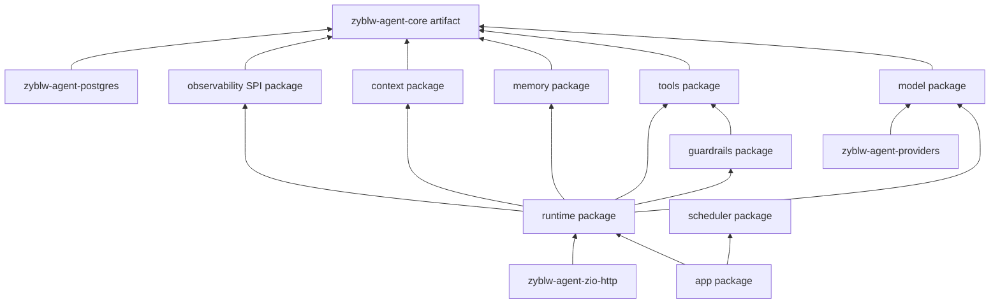

# 从 ZIO 到可靠智能体：zyblw-agent 深入学习指南

> 状态：学习指南
> 最后核验：2026-07-25
> 事实来源：当前模块源码、测试、ADR，以及 ZIO/ZIO HTTP、OpenAI、Anthropic、MCP 官方资料

阅读本篇前，建议先看 [能力审计、框架对照与演进判断](framework-assessment.md)，避免把“代码里存在一个 SPI”
误解为“该能力已经生产成熟”；理解 Prompt、动态资料和成本链路时配合
[指令、Context 与成本工程](instruction-context-cost.md)。

## 1. 先建立正确的问题意识

智能体框架不是“调用一次大模型 API 的封装”，也不是“把很多 Agent 连成图”。一个可用的 Agent 系统必须持续回答五个工程问题：

1. **模型现在可以看见什么？**——Context、检索、记忆和权限过滤。
2. **模型现在可以建议做什么？**——工具 schema、能力协商和 instructions。
3. **谁决定它能否真的做？**——后端 policy、所有权、预算、审批和医疗边界。
4. **进程或网络失败后如何继续？**——状态、事件、命令、幂等、lease、fencing、工具账本。
5. **我们如何知道它变好了？**——trace、指标、固定 eval、趋势、用户反馈和人工复核。

只回答了前两项的是聊天/工具 demo；把五项放进同一可解释控制面的系统，才接近生产 Agent harness。

OpenAI 的公开工程指南把 Agent 的基础概括为 model、tools、instructions，并建议先最大化单 Agent，再由评测证明是否需要多 Agent。Anthropic 同样区分固定 workflow 与模型自主决定步骤的 agent，并强调从简单可组合模式开始。zyblw-agent 采用这一基线，但用 Scala 类型与 ZIO 生命周期进一步约束实现。

## 2. 为什么使用 ZIO

### 2.1 Effect 是可执行程序的描述

```scala
ZIO[R, E, A]
```

它表达：执行需要 `R`，可能以 `E` 失败，成功产生 `A`。Agent 的模型流、工具、数据库、超时、取消和审批本来就充满异步与失败；Effect 把它们保留为可组合值，而不是散落 callback、Future、throw 和全局状态。

这带来几个关键能力：

- typed error 可以区分 Provider、权限、预算、工具、恢复冲突；
- `timeout`、`retry`、`race`、`ensuring` 能在语义上组合；
- 测试可替换 Clock、Random、服务 Layer；
- 中断会沿 Fiber 树传播，不需要自己维护一堆 cancellation flag。

### 2.2 ZLayer 是构造图，不是魔法容器

`ZLayer[RIn, E, ROut]` 描述如何从输入服务获取输出服务，并在 Scope 中管理资源。框架把 `ChatModel`、`RunStore`、`ContextManager`、`GuardrailEngine`、`ToolExecutor`、`RunObserver` 都定义为窄 SPI；业务在 composition root 选择 Live 实现。

正确理解：Layer 解决“对象如何被创建、共享、释放”。它不应该让业务方法随处动态查找任何对象，也不应该隐藏一个生产环境 fallback。`AgentApplication.durable` 因此要求调用者显式提供持久化、Context、Guardrail 和 Observer。

### 2.3 Scope 是资源安全边界

Provider HTTP client、DataSource、事件队列、Worker、SSE subscription 都有生命周期。`ZIO.scoped` 与 `ZLayer.scoped` 保证正常、失败和中断都执行 release。一个 HTTP 客户端断开时，流和子 Fiber 应被中断；一个关键 Worker 退出时，宿主应显式失败，而不是继续假健康。

### 2.4 Fiber 与结构化并发

Fiber 是轻量并发执行单元，但“轻量”不等于“可以无限 fork”。框架需要限制：

- 每次 Run 的总时长、模型轮数和工具次数；
- 一个 step 的工具并行度；
- Provider、数据库连接和外部 API 的全局并发；
- 子 Fiber 归属和取消传播。

`forkDaemon` 很方便，也很危险：它切断父 Scope。zyblw-agent 的长生命周期 Worker 由明确宿主管理，Run/工具 Fiber 必须可追踪、可中断。

### 2.5 Ref、Queue、Stream 应用在哪里

- `Ref`：进程内原子状态，例如当前 active Run fiber map；不能替代跨节点数据库事实。
- `Queue`：有界进程内生产/消费与背压；崩溃后不保留，不能冒充 durable command queue。
- `ZStream`：模型增量事件、Agent event、SSE；必须考虑消费速度、中断和边界缓存。
- `Semaphore`：限制并发资源；不能代替数据库跨节点锁。

判断原则：进程崩溃后还必须存在的状态进入 durable store；只服务当前进程协作的状态才用内存原语。

## 3. 代码库分层：稳定内核与可替换外壳



### 3.1 `zyblw-agent-core`

定义稳定语言：`AgentDefinition`、`RunRequest`、`RunContext`、`RunLimits`、`AgentState`、`AgentEvent`、`AgentError`、ID 与状态。它不知道 OpenAI、PostgreSQL 或 HTTP。

这是最重要的架构品味：**让业务状态与外部协议解耦**。如果 core 直接出现某厂商 response class，更换 Provider 会污染整个系统；如果 core 直接等于 HTTP DTO，内部恢复字段会意外变成长期公共兼容负担。

### 3.2 `model` package

定义 `ChatModel` 和 Provider-neutral 事件。Provider Adapter 负责把不同厂商的文本 delta、tool call、usage、finish/error 映射成统一语义，并通过 capability 描述其真正支持的功能。

Capability 不能靠猜：支持流式文本不代表支持并行工具、结构化输出或原生图像。启动或提交时应 fail-fast，而不是运行一半才发现。

### 3.3 `tools` 与 `guardrails` package

工具是受控能力，不是任意函数。注册表把模型看到的名称绑定到 typed schema、风险级别、权限、超时、结果限制和真实执行器。Guardrail 是分层决策：输入、工具计划、工具结果、最终输出都可能需要检查。

### 3.4 `runtime` package

这是唯一生产状态机。它协调 Context、模型、工具、Guardrail、Store、预算和 Observer。没有第二套隐藏 checkpoint；所有恢复需要的信息必须进入 `AgentState`、Event 或工具账本。

### 3.5 `app` 与 `scheduler` package

`AgentApplication` 是业务门面：同步或耐久提交、查看、取消、恢复、启动 Worker。Scheduler/WorkerHost 处理 command claim、lease、heartbeat、generation fencing。它们不重写 Runtime 规则，只决定谁在何时执行哪条耐久命令。

### 3.6 外层模块

Provider、PostgreSQL、OTLP、HTTP、MCP、文档 Loader、Reranker 都是可选 Adapter。模块化的价值是“未使用的基础设施不会进入核心依赖和后台线程”，不是为了追求模块数量。

## 4. AgentDefinition：声明能力，不通过继承扩循环

`AgentDefinition` 冻结：

- 稳定 Agent ID 与显示名；
- instructions；
- allowed tool 白名单；
- model settings；
- context policy；
- 低敏 metadata。

创建 Run 时保存 definition 快照，这解决部署漂移：旧 Run 恢复时继续使用创建当时的配置，而不是被新部署的 prompt/预算静默改变。

框架选择数据配置而非 `class MyAgent extends BaseAgent`。继承很容易把业务差异藏进 override，难以持久化和比较；不可变定义更适合审计、版本、评测与恢复。

## 5. 单 Agent 循环

可以把运行时抽象为：

```text
load/create state
  -> input guardrail
  -> build bounded context
  -> call model stream
  -> no tool? validate output and complete
  -> has tool? parse -> allowlist -> policy -> approval/execute
  -> append structured result
  -> persist versioned state/events
  -> next turn until hard stop
```

### 5.1 每个工具建议必须有一个结果

模型提出一个 call 后，Runtime 必须返回 exactly one：成功、schema 错误、未知工具、拒绝、需审批、超时、失败或取消。悄悄丢弃会破坏模型对世界状态的理解，也让 trace 无法解释。

### 5.2 先解析，再授权，再执行

顺序很重要：

1. 名称与 schema 是否有效；
2. 是否在 Agent allowlist；
3. RunContext scope/tenant/user 是否允许；
4. 风险级别是否需要审批；
5. 预算和并发是否允许；
6. scoped 执行和结果裁剪；
7. 持久化结果。

不能让工具自己在执行后才发现无权访问，也不能让 prompt 中一句“只读”代替后端检查。

### 5.3 硬终止条件

`RunLimits` 是统一事实：步数、工具次数、输入/输出 token、费用、时长、重试等。预算必须在调用前预检、调用后结算，恢复时继续使用已消费值。否则重启会“刷新预算”，形成无限运行。

### 5.4 工具计划与并行

一次模型响应可能提出多个工具。Runtime 先构造 `DurableToolPlan`，按读写冲突分成 batch：安全的独立只读可在同一 batch 并行；审批写或冲突资源串行。计划、batch index 和 next cursor 持久化，崩溃后从未提交批次继续。

并行不是简单 `collectAllPar`。需要静态冲突信息、最大并行度、结果顺序稳定、取消传播和每个调用独立账本。

## 6. 耐久性：状态、事件、命令三者不能混为一谈

### 6.1 State

`AgentState` 是某 Run 当前恢复快照：status、messages、steps、budget、pending tool plan/approval、版本等。读取它可以快速决定下一步。

### 6.2 Event

Event 是发生过的低层操作记录，用于 SSE、审计、观测和部分重建。事件与 state 在同一乐观锁事务提交，避免 state 前进而 event 丢失。

### 6.3 Command

Command 表示尚待或正在执行的意图：Start、ResumeApproval、Cancel、Recover。它有 owner、lease、heartbeat、attempt、generation 和终态。HTTP 只提交 command，Worker 异步处理，因此请求超时不等于执行丢失。

### 6.4 乐观锁与 fencing

普通 `expectedVersion` 防止两个执行者覆盖同一 state。分布式 Worker 还需要 fencing token/generation：旧 Worker lease 过期后即使网络恢复，它提交的 token 已过期，数据库拒绝写入。只有 lease 没有 fenced commit 会产生 zombie writer。

### 6.5 工具账本

外部副作用可能发生在“调用成功、结果未提交”窗口。框架以 stable call ID/ledger 判断是否已经执行。真正的写工具还需要目标系统幂等键、outbox/inbox 或显式补偿；框架无法凭空把任意外部 API 变成 exactly-once。

## 7. 工具安全与人工审批

风险等级从只读到管理员审批。关键思想不是“每次都弹窗”，而是让 autonomy 与后果匹配：

- 公开或用户域只读：规则允许后自动执行；
- draft write：只创建草稿，不对外生效；
- approval write：展示目标、参数和影响后由人确认；
- admin/high-stakes：更强身份、审计和双重检查。

审批时保存原始 tool call、policy 版本、reason 与状态；恢复必须执行被批准的同一个调用，不能让模型借审批机会换参数。

医疗建议、发布内容、删除、外发消息、改权限属于高风险。zyblw 当前学习问答只开放 `search_articles` 只读工具，这是刻意的产品边界。

## 8. Context、Memory、RAG 是三个问题

### 8.1 Context

Context 是本次模型调用实际看到的 token 序列。它有硬预算，通常包含 instructions、最近对话、摘要、检索证据和工具结果。Context Manager 负责选择和压缩，不负责永久存储一切。

### 8.2 Memory

Memory 是跨调用保存、未来可能再次使用的信息。它必须回答：谁可见、为何保存、置信度、来源、何时过期、用户如何查看/删除。聊天历史不是天然长期记忆，模型自动抽取的健康画像尤其敏感。

### 8.3 RAG

RAG 是从外部知识语料检索证据并生成有依据输出。一个可信 RAG 管线包括权限过滤、摄取/分段、embedding 版本、检索、可选 rerank、Context 装配、citation、撤回和评测。仅接向量库不等于 RAG 完成。

### 8.4 压缩的真实性

确定性压缩可复现但表达能力有限；模型摘要表达好但可能遗漏或伪造。当前设计把模型压缩放在 core 中可选的
`context.llm` 组件，Context 保持 Provider-neutral，并通过逐字证据/评测约束。摘要需要保存来源区间和版本，不能成为
不可追溯“新事实”。

## 9. Provider Adapter 与流

不同 Provider 的 API 形态、错误、工具 delta 和 usage 差异很大。Adapter 应做：

- 请求映射与 capability 验证；
- 流事件累积和 tool argument 拼接；
- finish reason/usage/error 归一化；
- timeout、429/5xx 分类与有限重试；
- 响应/错误 body 大小限制和脱敏；
- 客户端资源由 Scope 管理。

Adapter 不应做：业务权限、医疗判断、Run 状态转移或产品引用投影。否则每加一个 Provider 都复制业务规则。

## 10. HTTP 公共契约

`zyblw-agent-zio-http` 内部以 package 保持边界：`http.contract` 定义版本化 DTO、Endpoint 和 OpenAPI，`http` 把内部
state/event 投影为低敏公共对象，`http.host` 提供可选独立宿主。跨语言客户端直接消费 OpenAPI。

分离的原因：

- 内部恢复字段可以演进；
- 客户端不看到 prompt、原始 tool payload 或敏感 metadata；
- 公共协议可以做兼容测试；
- 嵌入 server 和独立部署复用相同 Contract。

ZIO HTTP Endpoint 的声明式输入/输出/错误可以生成 OpenAPI，并利用类型化 path/query/body codec；这比 Handler 手工解析后另写一份文档更不易漂移。

## 11. 可观测性：记录操作证据，不记录隐藏思维

建议 trace 维度：runId、threadId（必要时哈希）、agent/version、model、step、tool、policy decision、duration、token、cost、retry、error class、grounding/safety result。

默认不记录：system prompt 全文、用户健康正文、工具原始大结果、secret、Authorization、模型隐藏推理。高基数或敏感字段进入受控 trace/event，不作为 metrics label。

OTLP 模块是可选生产 Adapter；没有配置时使用 noop observer，不应阻断核心业务。但“没有观测也能跑”不等于可以上线，生产门禁仍需真实指标。

## 12. 评测是框架演进的方向盘

一个固定 eval case 应包含输入、初始上下文、允许工具、期望关键行为、禁止行为和 grader。评测至少分层：

- 确定性 contract：schema、权限、状态、幂等、恢复；
- 工具轨迹：是否选对工具、参数、调用顺序、是否多余；
- RAG：Recall、MRR/NDCG、citation precision/coverage、越权泄露；
- 安全：医疗拒答、prompt injection、敏感数据、误报漏报；
- 输出质量：有用性、完整性、诚实不确定性；
- 运行质量：延迟、token、成本、失败/恢复、人介入率。

Anthropic 2026 年的 Agent eval 工程文章强调组合 grader、从失败样本扩展数据集并同时看最终结果和轨迹。当前 `agent-evals`、低敏 snapshot、趋势 store 和 eval CLI 正是朝“每次变更可比较”演进，而不是追求一个好看的静态 benchmark。

### 12.1 运行事实、读模型与答案质量是三件事

一次 Run 至少有三类不同问题：

1. **执行事实**：状态、事件、命令、工具账本记录实际发生了什么；
2. **运维读模型**：Inspector 把事实投影成低敏 Timeline，并检查 sequence、审批、预算等结构一致性；
3. **业务质量**：Eval 判断答案、引用、工具轨迹、安全、延迟和成本是否达标。

Inspector 绿色不能证明答案正确，Eval 高分也不能证明状态/事件原子一致。把两者混为一个“成功率”，会使故障无法定位：
究竟是模型质量、检索质量，还是运行控制面出了问题。对应代码与练习见
[Run Inspector、Timeline 与安全调试](run-inspection.md)。

## 13. MCP、Skills 与开放生态

MCP 是 host-client-server 的协议边界，提供 tools/resources/prompts 等能力协商。Host 必须控制连接、权限、用户授权和数据聚合；服务器返回的 tool description 与内容仍是不可信数据。

当前框架 MCP client 是 Beta：适合受控只读实验，OAuth/server、Roots、真实隔离和全面安全门禁尚未成熟。不能因为 MCP 是标准协议就自动信任第三方 server。

Agent Skills 是渐进加载的程序性知识：启动只读 name/description，触发后读 SKILL.md，需要时读 references/scripts。它适合教 harness 如何工作，不应获得超出任务的默认工具权限。项目对 Skills 同样执行来源审核和删除机制。

## 14. 框架做了什么、刻意舍弃什么

已经选择：

- 单 Agent、类型化工具、显式权限；
- 事件 + 快照 + command queue 的耐久控制面；
- Provider-neutral core 和独立公共 HTTP contract；
- Context/Memory/RAG 分离；
- 可选重型 Adapter；
- eval/trace 是一等能力。

刻意舍弃：

- 以图 DSL 作为所有业务唯一表达；
- 默认多 Agent；
- 任意 shell/SQL/HTTP 万能工具；
- 生产静默回退内存 store/noop safety；
- 自动保存一切长期记忆；
- 把内部状态直接作为公共 API；
- 通过记录模型完整推理来“可观测”。

这些舍弃让框架少一些炫目 demo，却换来更清晰的责任、恢复和安全边界。

## 15. 如何开发一个新 Agent 应用

### 第一步：证明需要 Agent

如果确定性搜索、表单或工作流足够，就不要引入自主循环。Agent 适合规则难维护、需要处理非结构化资料、步骤依赖上下文的任务。

### 第二步：定义产品成功与禁止范围

写出用户、输入、可验证结果、失败转交、医疗/隐私风险、延迟和成本预算。没有评测标准就无法判断架构是否过度。

### 第三步：设计最小工具集

每个工具只做一个业务动作，包含 schema、所有权、风险、幂等、超时、裁剪、审计和测试。先只读，再 draft，再审批写。

### 第四步：定义 AgentDefinition 与 ContextPolicy

Instructions 讲目标、边界和工具使用；硬安全规则仍在代码。只把完成任务必需的信息装入 Context。

### 第五步：选择持久化等级

- 低风险短任务/测试可内存同步；
- 用户可见、耗时、付费或有副作用的任务使用 durable submission；
- 跨节点运行需要 command lease/fencing 和共享 event store。

### 第六步：先写 eval，再扩大能力

至少准备 happy path、未知工具、拒绝/审批、Provider/工具失败、注入、无来源、高风险医疗、预算耗尽和恢复。只有 eval 显示瓶颈，才加 memory、reranker、workflow 或多 Agent。

### 第七步：通过 AgentApplication 接入

业务宿主提供 Provider、Store、工具、Context、Guardrail、Observer；框架提供 Runtime/Worker/command。不要绕过 Application 直接拼第二条生产循环。

## 16. 客观成熟度判断

当前代码是“覆盖面广、核心路径有实质实现、部分模块仍实验”的工程框架，不是已经被大规模生产证明的平台。核心 state/runtime/tool/command 思路有良好测试基础；Provider、HTTP、PostgreSQL、OTLP 已有真实 Adapter；但外部系统长期稳定性、吞吐、数据迁移、RAG 质量、MCP 安全和运营流程仍需真实负载验证。

模块多不是成熟度。成熟度来自：稳定契约、故障注入、恢复演练、升级兼容、性能数据、安全审查、持续 eval 和真实用户结果。详细矩阵见 [成熟度与路线](maturity-and-roadmap.md)。

## 17. 学习练习

1. 阅读 `AgentDefinition` 和 `AgentState`，画出不可变定义与可变运行状态的边界。
2. 跟踪 `AgentRuntimeLive.run -> startCreated -> loop`，记录每个持久化点与中断点。
3. 用一个未知工具测试 case，解释为何返回结构化错误而不是丢弃。
4. 模拟 Worker lease 过期，解释 generation fencing 如何阻止旧提交。
5. 对比 `qa_message` 与 `agent_events`，说明产品投影和控制面状态为何分离。
6. 为一个“生成文章草稿”工具设计 risk、approval、idempotency 与 outbox，但先不实现发布。
7. 给 `search_articles` 建一个小型 recall/citation eval，并区分检索失败和生成失败。
8. 阅读一个 Provider adapter，列出厂商协议与 core 事件之间的全部映射。
9. 调用 Inspector，解释 `consistent` 与 `completeHistory` 的区别，并证明 JSON 中没有用户输入和工具结果。

## 官方延伸阅读

- [ZIO Reference](https://zio.dev/reference/)
- [ZIO HTTP Endpoint](https://ziohttp.com/concepts/endpoint/)
- [OpenAI：A practical guide to building agents](https://openai.com/business/guides-and-resources/a-practical-guide-to-building-ai-agents/)
- [Anthropic：Building effective agents](https://www.anthropic.com/engineering/building-effective-agents)
- [Anthropic：Demystifying evals for AI agents](https://www.anthropic.com/engineering/demystifying-evals-for-ai-agents)
- [MCP Architecture](https://modelcontextprotocol.io/specification/draft/architecture)
- [Agent Skills Specification](https://agentskills.io/specification)
